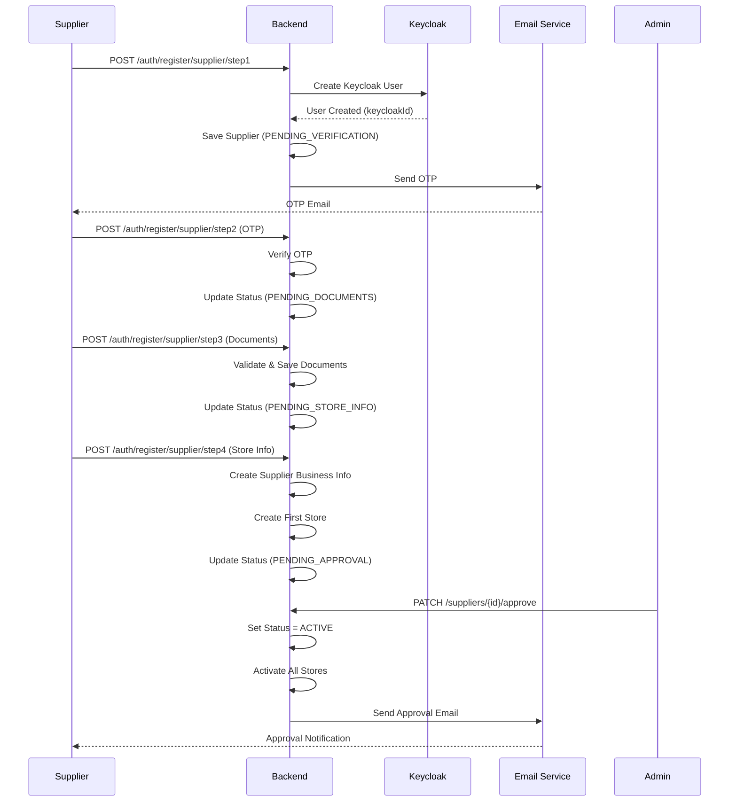
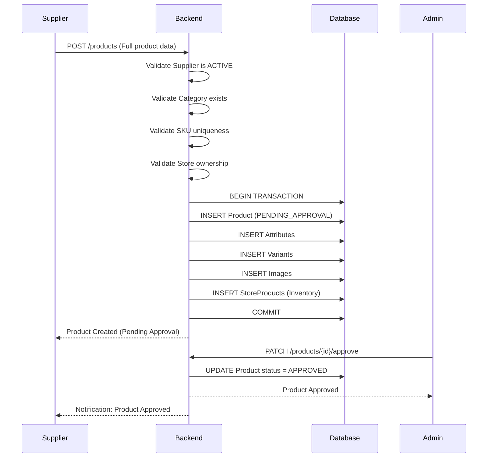
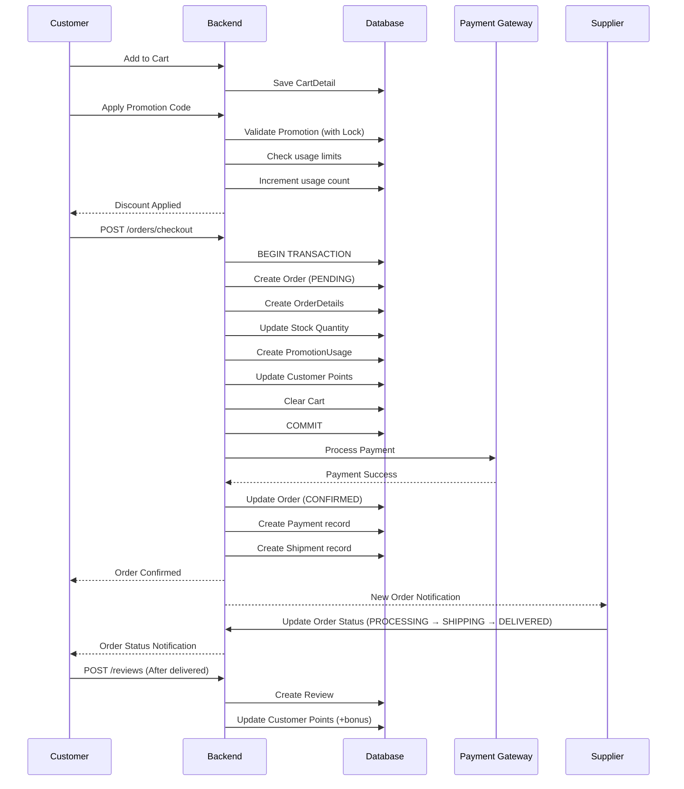
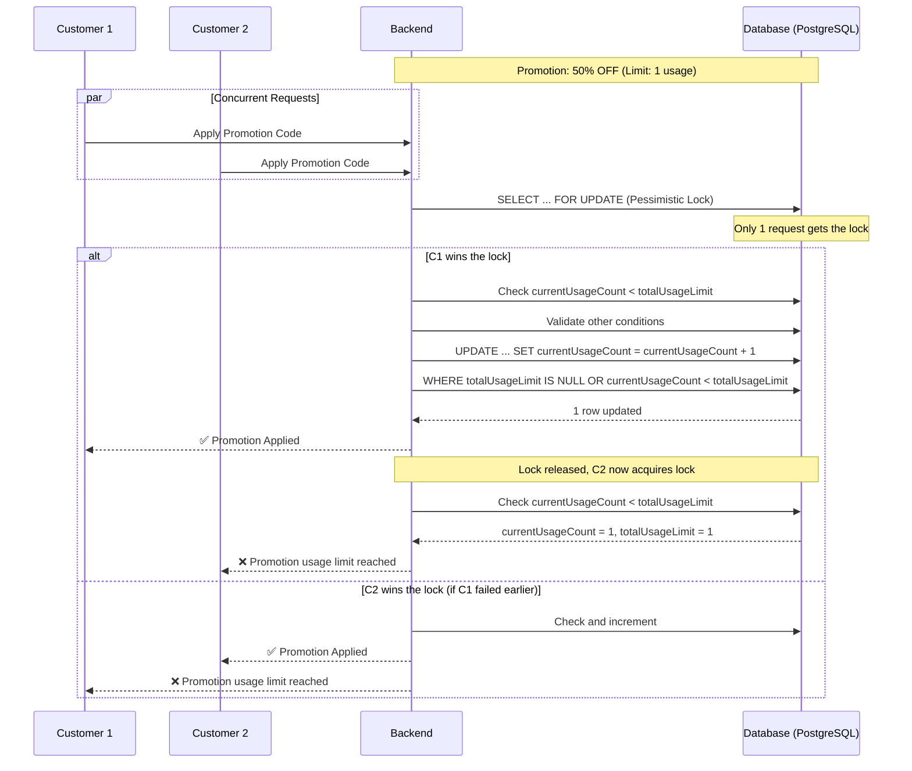

# 📊 PHÂN TÍCH NGHIỆP VỤ HỆ THỐNG SaveFood

**Business Analyst Report**
**Ngày phân tích:** 19/10/2025
**Phạm vi:** Toàn bộ hệ thống Backend & Frontend

---

## 📋 MỤC LỤC

1. [Tổng quan hệ thống](#1-tổng-quan-hệ-thống)
2. [Các đối tượng nghiệp vụ chính](#2-các-đối-tượng-nghiệp-vụ-chính)
3. [Tóm tắt chức năng theo vai trò](#3-tóm-tắt-chức-năng-theo-vai-trò)
4. [Luồng nghiệp vụ chính](#4-luồng-nghiệp-vụ-chính)
5. [Các tài liệu chi tiết](#5-các-tài-liệu-chi-tiết)

---

## 1. TỔNG QUAN HỆ THỐNG

### 1.1. Tên dự án

**SaveFood** - Nền tảng kết nối khách hàng với các cửa hàng thực phẩm để giảm lãng phí thực phẩm

### 1.2. Mô hình kinh doanh

- **Marketplace B2C**: Kết nối nhà cung cấp (Supplier) với khách hàng (Customer)
- **Commission-based**: Hệ thống thu hoa hồng từ các giao dịch
- **Focus**: Sản phẩm thực phẩm gần hết hạn với giá ưu đãi

### 1.3. Các bên liên quan (Stakeholders)

| Vai trò              | Mô tả                              | Số lượng dự kiến          |
| --------------------- | ------------------------------------ | ------------------------------ |
| **Customer**    | Khách hàng mua sản phẩm          | Không giới hạn              |
| **Supplier**    | Nhà cung cấp/cửa hàng bán hàng | Hàng trăm đến hàng nghìn |
| **Admin**       | Quản trị viên hệ thống          | 5-20 người                   |
| **Super Admin** | Quản trị viên cấp cao            | 1-3 người                    |
| **Moderator**   | Điều hành viên                   | 3-10 người                   |
| **Staff**       | Nhân viên hỗ trợ                 | 5-15 người                   |

### 1.4. Công nghệ sử dụng

**Backend:**

- Java 17 + Spring Boot 3.x
- PostgreSQL Database
- Redis (Cache & OTP)
- Keycloak (Authentication)
- Cloudinary (File Storage)

**Frontend:**

- React 18+ with TypeScript
- Vite (Build tool)
- TailwindCSS
- React Router v7

---

## 2. CÁC ĐỐI TƯỢNG NGHIỆP VỤ CHÍNH

### 2.1. Core Entities

#### A. Người dùng (Users)

```
User (Base Entity)
├── Customer (Khách hàng)
├── Supplier (Nhà cung cấp)
└── Admin (Quản trị viên)
```

#### B. Sản phẩm (Products)

```
Product (Sản phẩm chính)
├── ProductAttribute (Thuộc tính: Thương hiệu, Xuất xứ...)
├── ProductVariant (Biến thể: Kích cỡ, Vị, HSD...)
│   └── StoreProduct (Tồn kho tại từng cửa hàng)
└── ProductImage (Hình ảnh)
```

#### C. Đơn hàng (Orders)

```
Order (Đơn hàng)
├── OrderDetail (Chi tiết đơn hàng)
├── Payment (Thanh toán)
├── Shipment (Vận chuyển)
└── PromotionUsage (Khuyến mãi áp dụng)
```

### 2.2. Supporting Entities

| Entity                 | Mục đích              |
| ---------------------- | ------------------------ |
| **Category**     | Danh mục sản phẩm     |
| **Store**        | Cửa hàng của supplier |
| **Cart**         | Giỏ hàng               |
| **Promotion**    | Mã khuyến mãi         |
| **Review**       | Đánh giá sản phẩm   |
| **Address**      | Địa chỉ giao hàng    |
| **Notification** | Thông báo hệ thống   |
| **Banner**       | Banner quảng cáo       |
| **NewsArticle**  | Bài viết tin tức      |

---

## 3. TÓM TẮT CHỨC NĂNG THEO VAI TRÒ

### 🛒 CUSTOMER (Khách hàng)

#### Quản lý tài khoản

- ✅ Đăng ký tài khoản (Username + Email + Phone + OTP)
- ✅ Đăng nhập/Đăng xuất
- ✅ Xem/Cập nhật profile
- ✅ Quản lý địa chỉ giao hàng
- ✅ Quản lý điểm thưởng (Points)
- ✅ Xem tier membership (Bronze/Silver/Gold/Platinum)

#### Mua sắm

- ✅ Tìm kiếm sản phẩm
- ✅ Lọc theo danh mục, giá, cửa hàng
- ✅ Xem chi tiết sản phẩm (variants, giá, HSD)
- ✅ Thêm vào giỏ hàng
- ✅ Áp dụng mã khuyến mãi
- ✅ Đặt hàng
- ✅ Thanh toán (COD, VNPay, Momo, ZaloPay)
- ✅ Theo dõi đơn hàng
- ✅ Hủy đơn hàng (nếu chưa giao)

#### Tương tác

- ✅ Đánh giá sản phẩm/cửa hàng
- ✅ Xem lịch sử mua hàng
- ✅ Xem lịch sử tích điểm
- ✅ Nhận thông báo
- ✅ Chat với cửa hàng (dự kiến)

---

### 🏪 SUPPLIER (Nhà cung cấp)

#### Đăng ký & Quản lý tài khoản

- ✅ Đăng ký 4 bước:
  1. Tạo tài khoản (Username, Email, Phone)
  2. Xác thực Email (OTP)
  3. Upload giấy tờ (Business License, Food Safety Certificate)
  4. Thông tin cửa hàng đầu tiên
- ✅ Chờ duyệt từ Admin
- ✅ Cập nhật profile & thông tin ngân hàng

#### Quản lý cửa hàng

- ✅ Tạo/Cập nhật thông tin cửa hàng
- ✅ Quản lý nhiều cửa hàng
- ✅ Yêu cầu cập nhật thông tin cửa hàng (pending approval)
- ✅ Xem đánh giá cửa hàng

#### Quản lý sản phẩm

- ✅ Tạo sản phẩm với nhiều variants
- ✅ Upload hình ảnh sản phẩm
- ✅ Quản lý tồn kho theo từng cửa hàng
- ✅ Cập nhật giá, HSD
- ✅ Chờ admin duyệt sản phẩm mới
- ✅ Đề xuất danh mục mới

#### Quản lý đơn hàng

- ✅ Xem đơn hàng mới
- ✅ Xác nhận/Từ chối đơn hàng
- ✅ Cập nhật trạng thái đơn hàng
- ✅ Quản lý vận chuyển
- ✅ Xem báo cáo doanh thu
- ✅ Xem hoa hồng phải trả

---

### 👨‍💼 ADMIN (Quản trị viên)

#### Phân quyền Admin

- **Super Admin**: Toàn quyền
- **Moderator**: Duyệt supplier, sản phẩm, xử lý khiếu nại
- **Staff**: Hỗ trợ khách hàng, xem báo cáo

#### Quản lý người dùng

- ✅ Xem danh sách Customer
- ✅ Xem danh sách Supplier
- ✅ Duyệt/Từ chối Supplier mới
- ✅ Kích hoạt/Vô hiệu hóa tài khoản
- ✅ Quản lý Admin/Staff (Super Admin only)

#### Quản lý sản phẩm & danh mục

- ✅ Duyệt sản phẩm mới
- ✅ Từ chối sản phẩm (với lý do)
- ✅ Quản lý danh mục (CRUD)
- ✅ Duyệt đề xuất danh mục từ Supplier
- ✅ Upload hình ảnh danh mục

#### Quản lý cửa hàng

- ✅ Xem danh sách cửa hàng
- ✅ Duyệt cập nhật thông tin cửa hàng
- ✅ Vô hiệu hóa cửa hàng vi phạm

#### Quản lý khuyến mãi

- ✅ Tạo/Cập nhật/Xóa mã khuyến mãi
- ✅ Quản lý tier (Bronze, Silver, Gold, Platinum)
- ✅ Thiết lập highlight promotion
- ✅ Xem thống kê sử dụng mã
- ✅ Xem lịch sử validation

#### Marketing & Nội dung

- ✅ Quản lý Banner
- ✅ Tạo/Chỉnh sửa tin tức
- ✅ Gửi thông báo hệ thống

#### Báo cáo & Phân tích

- ✅ Báo cáo doanh thu
- ✅ Báo cáo hành vi khách hàng
- ✅ Báo cáo lãng phí thực phẩm
- ✅ Báo cáo hiệu suất supplier
- ✅ Dashboard tổng quan

#### Hệ thống

- ✅ Cấu hình thông báo
- ✅ Nhật ký hoạt động (Audit log)
- ✅ Quản lý phân quyền

---

## 4. LUỒNG NGHIỆP VỤ CHÍNH

### 4.1. Luồng đăng ký Supplier (4 bước)



### 4.2. Luồng tạo sản phẩm



### 4.3. Luồng đặt hàng



### 4.4. Luồng áp dụng mã khuyến mãi (với Race Condition Protection)



---

## 5. CÁC TÀI LIỆU CHI TIẾT

### 📁 Các file phân tích đã tạo:

1. **`BUSINESS_FUNCTIONS_BY_ROLE.md`** - Chi tiết chức năng từng vai trò
2. **`BUSINESS_WORKFLOWS.md`** - Các quy trình nghiệp vụ chi tiết
3. **`ENTITY_RELATIONSHIPS.md`** - Mối quan hệ giữa các entities
4. **`API_ENDPOINTS_SUMMARY.md`** - Tổng hợp API endpoints
5. **`DATABASE_SCHEMA.md`** - Schema cơ sở dữ liệu (đã có)
6. **`PRODUCT_CREATION_FLOW.md`** - Luồng tạo sản phẩm (đã có)

### 📊 Sơ đồ tổng quan hệ thống

```
┌─────────────────────────────────────────────────────────────┐
│                       SaveFood SYSTEM                        │
├─────────────────────────────────────────────────────────────┤
│                                                              │
│  ┌────────────┐      ┌────────────┐      ┌────────────┐   │
│  │  Customer  │      │  Supplier  │      │   Admin    │   │
│  │  (Mobile)  │      │   (Web)    │      │   (Web)    │   │
│  └──────┬─────┘      └──────┬─────┘      └──────┬─────┘   │
│         │                   │                    │          │
│         └───────────────────┴────────────────────┘          │
│                            │                                │
│                  ┌─────────▼─────────┐                     │
│                  │   API Gateway      │                     │
│                  │  (Spring Boot)     │                     │
│                  └─────────┬─────────┘                     │
│                            │                                │
│         ┌──────────────────┼──────────────────┐            │
│         │                  │                  │            │
│   ┌─────▼─────┐    ┌──────▼──────┐    ┌─────▼─────┐      │
│   │ Keycloak  │    │ PostgreSQL  │    │  Redis    │      │
│   │  (Auth)   │    │  (Database) │    │  (Cache)  │      │
│   └───────────┘    └─────────────┘    └───────────┘      │
│                                                             │
│   ┌─────────────┐  ┌──────────────┐  ┌──────────────┐    │
│   │ Cloudinary  │  │ Email Service│  │ SMS Service  │    │
│   │   (Files)   │  │   (SMTP)     │  │  (Twilio)    │    │
│   └─────────────┘  └──────────────┘  └──────────────┘    │
│                                                             │
└─────────────────────────────────────────────────────────────┘
```

---

## 📈 METRICS & KPIs

### Business Metrics

- **GMV (Gross Merchandise Value)**: Tổng giá trị giao dịch
- **Take Rate**: % hoa hồng thu được
- **Active Suppliers**: Số supplier active
- **Active Customers**: Số customer có giao dịch trong 30 ngày
- **Conversion Rate**: % khách hàng đặt hàng từ giỏ hàng
- **Average Order Value (AOV)**: Giá trị đơn hàng trung bình

### Operational Metrics

- **Order Fulfillment Rate**: % đơn hàng giao thành công
- **Supplier Response Time**: Thời gian xác nhận đơn hàng
- **Customer Satisfaction Score (CSAT)**: Điểm đánh giá trung bình
- **Food Waste Reduction**: Kg thực phẩm cứu được
- **Promotion Usage Rate**: % mã KM được sử dụng

### Technical Metrics

- **API Response Time**: P95, P99
- **Error Rate**: % requests lỗi
- **Database Query Performance**: Avg query time
- **Concurrent Users**: Số người dùng đồng thời
- **System Uptime**: % thời gian hoạt động

---

## 🎯 ROADMAP & FUTURE FEATURES

### Phase 1 (Current - Q4 2025)

- ✅ Core marketplace functionality
- ✅ Supplier registration & approval
- ✅ Product management
- ✅ Order processing
- ✅ Promotion system with race condition protection

### Phase 2 (Q1 2026)

- 🔄 Mobile app for customers
- 🔄 Real-time chat between customer & supplier
- 🔄 Push notifications
- 🔄 Advanced search with Elasticsearch
- 🔄 Recommendation engine

### Phase 3 (Q2 2026)

- 📅 Subscription model (weekly food boxes)
- 📅 Social features (share deals, invite friends)
- 📅 Gamification (badges, leaderboards)
- 📅 Integration with delivery services
- 📅 AI-powered demand forecasting

### Phase 4 (Q3 2026)

- 📅 B2B marketplace
- 📅 Wholesale pricing
- 📅 Multi-language support
- 📅 Multi-currency support
- 📅 International expansion

---

**Prepared by:** GitHub Copilot (Business Analyst AI)
**Date:** October 19, 2025
**Version:** 1.0
