# Luồng tuần tự tổng: Từ Giỏ hàng đến Hoàn thành đơn hàng

## Biểu đồ tổng quan - Full Flow

```mermaid
sequenceDiagram
    actor Customer as 👤 Khách hàng
    actor Supplier as 🏪 Nhà cung cấp
    participant FE_C as Frontend Customer
    participant FE_S as Frontend Supplier
    participant Backend as Spring Boot API
    participant DB as MySQL Database
    participant Redis as Redis Cache
    participant Wallet as Wallet Service
    participant Notification as Notification Service
    participant WebSocket as WebSocket Server

    Note over Customer,WebSocket: ═══ PHASE 1: THÊM VÀO GIỎ HÀNG ═══
    
    Customer->>FE_C: 1. Xem sản phẩm trên trang chủ
    FE_C->>Backend: GET /api/products?page=0&size=20
    Backend->>Redis: Check cache
    
    alt Cache hit
        Redis-->>Backend: Cached products
    else Cache miss
        Backend->>DB: SELECT products WITH ratings
        DB-->>Backend: Product list
        Backend->>Redis: SET cache (TTL: 5min)
    end
    
    Backend-->>FE_C: {products[], totalPages}
    FE_C-->>Customer: Hiển thị danh sách sản phẩm
    
    Customer->>FE_C: 2. Click "Thêm vào giỏ" sản phẩm A
    FE_C->>Backend: POST /api/cart/items<br/>{productId: A, quantity: 2}
    Backend->>Backend: Verify JWT token
    
    Backend->>DB: SELECT stock FROM products<br/>WHERE productId=A
    
    alt Không đủ hàng
        DB-->>Backend: stock < quantity
        Backend-->>FE_C: 400 Bad Request
        FE_C-->>Customer: ❌ Không đủ số lượng
    else Đủ hàng
        Backend->>DB: INSERT INTO cart_items<br/>ON DUPLICATE KEY UPDATE quantity
        Backend->>DB: SELECT SUM(quantity * price)<br/>FROM cart_items
        DB-->>Backend: Cart total
        Backend-->>FE_C: 200 OK<br/>{cartItem, cartTotal}
        FE_C-->>Customer: ✅ Đã thêm vào giỏ (2 items)
    end
    
    Customer->>FE_C: 3. Tiếp tục mua sắm, thêm sản phẩm B
    FE_C->>Backend: POST /api/cart/items<br/>{productId: B, quantity: 1}
    Backend->>DB: INSERT/UPDATE cart_items
    Backend-->>FE_C: 200 OK
    FE_C-->>Customer: ✅ Giỏ hàng: 3 items
    
    Note over Customer,WebSocket: ═══ PHASE 2: CHECKOUT & TẠO ĐỚN HÀNG ═══
    
    Customer->>FE_C: 4. Click "Thanh toán"
    FE_C->>Backend: GET /api/cart
    Backend->>DB: SELECT cart_items WITH product details
    Backend-->>FE_C: {cartItems[], totalAmount}
    FE_C-->>Customer: Hiển thị trang checkout
    
    Customer->>FE_C: 5. Nhập địa chỉ giao hàng<br/>Chọn thanh toán: COD
    FE_C->>Backend: POST /api/orders/checkout<br/>{deliveryAddress, paymentMethod: 'COD'}
    
    Backend->>DB: BEGIN TRANSACTION
    
    Backend->>DB: SELECT cart_items FOR UPDATE<br/>(Pessimistic lock)
    DB-->>Backend: Cart items locked
    
    alt Giỏ hàng trống
        Backend->>DB: ROLLBACK
        Backend-->>FE_C: 400 Bad Request
        FE_C-->>Customer: ❌ Giỏ hàng trống
    else Có sản phẩm
        loop Kiểm tra từng sản phẩm
            Backend->>DB: SELECT stock FROM products<br/>WHERE productId FOR UPDATE
            
            alt Stock < quantity
                Backend->>DB: ROLLBACK
                Backend-->>FE_C: 400 Bad Request<br/>"Sản phẩm A hết hàng"
                FE_C-->>Customer: ❌ Sản phẩm hết hàng
            end
        end
        
        Note over Backend,DB: Tất cả sản phẩm OK, tạo đơn hàng
        
        Backend->>DB: INSERT INTO orders<br/>(customerId, storeId, totalAmount,<br/>deliveryAddress, paymentMethod,<br/>status='PENDING')
        DB-->>Backend: orderId, orderCode=#ORD12345
        
        loop Cho mỗi cart item
            Backend->>DB: INSERT INTO order_items<br/>(orderId, productId, quantity, price)
            Backend->>DB: UPDATE products<br/>SET stock = stock - quantity
        end
        
        Backend->>DB: DELETE FROM cart_items<br/>WHERE customerId
        
        Backend->>DB: COMMIT TRANSACTION
        
        Backend->>Notification: Send to supplier<br/>"Đơn hàng mới #ORD12345"
        Backend->>WebSocket: Broadcast to supplier<br/>/topic/orders/new
        
        Backend-->>FE_C: 201 Created<br/>{order, orderCode}
        FE_C-->>Customer: ✅ Đơn hàng đã được tạo<br/>Mã đơn: #ORD12345
    end
    
    Note over Customer,WebSocket: ═══ PHASE 3: NHÀ CUNG CẤP XEM & XÁC NHẬN ═══
    
    WebSocket-->>FE_S: 🔔 Real-time notification
    FE_S-->>Supplier: 🔔 Bạn có đơn hàng mới!
    
    Supplier->>FE_S: 6. Vào trang "Quản lý đơn hàng"
    FE_S->>Backend: GET /api/supplier/orders?status=PENDING
    Backend->>DB: SELECT orders WHERE storeId<br/>AND status='PENDING'
    DB-->>Backend: Pending orders
    Backend-->>FE_S: {orders[]}
    FE_S-->>Supplier: Hiển thị đơn #ORD12345
    
    Supplier->>FE_S: 7. Click "Xem chi tiết đơn"
    FE_S->>Backend: GET /api/supplier/orders/ORD12345
    Backend->>DB: SELECT order WITH items, customer
    Backend-->>FE_S: {order details}
    FE_S-->>Supplier: Hiển thị:<br/>- Sản phẩm A x2<br/>- Sản phẩm B x1<br/>- Địa chỉ giao hàng<br/>- Tổng tiền: 500,000đ
    
    Supplier->>FE_S: 8. Click "Xác nhận đơn hàng"
    FE_S->>Backend: PUT /api/supplier/orders/ORD12345/confirm
    
    Backend->>Backend: Verify JWT & supplierId
    Backend->>DB: SELECT order WHERE orderId<br/>AND storeId IN (supplier's stores)
    
    alt Order không thuộc supplier
        DB-->>Backend: Not found
        Backend-->>FE_S: 403 Forbidden
        FE_S-->>Supplier: ❌ Không có quyền
    else Order hợp lệ
        alt Status != PENDING
            Backend-->>FE_S: 400 Bad Request
            FE_S-->>Supplier: ❌ Đơn hàng đã được xử lý
        else Status = PENDING
            Backend->>DB: UPDATE orders<br/>SET status='CONFIRMED',<br/>confirmedAt=NOW()
            
            Backend->>Notification: Send to customer<br/>"Đơn hàng #ORD12345 đã được xác nhận"
            Backend->>WebSocket: Notify customer
            
            Backend-->>FE_S: 200 OK
            FE_S-->>Supplier: ✅ Đã xác nhận đơn hàng
            
            WebSocket-->>FE_C: 🔔 Notification
            FE_C-->>Customer: 🔔 Đơn hàng đã được xác nhận
        end
    end
    
    Note over Customer,WebSocket: ═══ PHASE 4: CHUẨN BỊ & GIAO HÀNG ═══
    
    Supplier->>FE_S: 9. Chuẩn bị hàng xong<br/>Click "Đang giao hàng"
    FE_S->>Backend: PUT /api/supplier/orders/ORD12345/shipping
    
    Backend->>DB: UPDATE orders<br/>SET status='SHIPPING',<br/>shippingAt=NOW()
    
    Backend->>Notification: Send to customer<br/>"Đơn hàng đang được giao"
    Backend->>WebSocket: Notify customer
    
    Backend-->>FE_S: 200 OK
    FE_S-->>Supplier: ✅ Đã cập nhật trạng thái
    
    WebSocket-->>FE_C: 🔔 Notification
    FE_C-->>Customer: 🚚 Đơn hàng đang trên đường giao
    
    Note over Supplier,Customer: --- Shipper giao hàng thành công ---
    
    Supplier->>FE_S: 10. Xác nhận "Đã giao hàng"
    FE_S->>Backend: PUT /api/supplier/orders/ORD12345/delivered
    
    Backend->>DB: BEGIN TRANSACTION
    
    Backend->>DB: UPDATE orders<br/>SET status='DELIVERED',<br/>deliveredAt=NOW(),<br/>balanceReleased=false
    
    Note over Backend,Wallet: ═══ XỬ LÝ VÍ NHÀ CUNG CẤP ═══
    
    Backend->>Wallet: addPendingBalance(supplierId, order, 500000đ)
    
    Wallet->>DB: SELECT supplier.commissionRate<br/>(Giả sử: 5%)
    DB-->>Wallet: commissionRate = 0.05
    
    Wallet->>Wallet: Calculate:<br/>- Commission = 500,000 × 0.05 = 25,000đ<br/>- Net amount = 500,000 - 25,000 = 475,000đ
    
    Wallet->>DB: SELECT supplier_wallets FOR UPDATE
    Wallet->>DB: UPDATE supplier_wallets<br/>SET pendingBalance += 475,000đ,<br/>totalEarnings += 475,000đ,<br/>monthlyEarnings += 475,000đ
    
    Wallet->>DB: INSERT INTO wallet_transactions<br/>(type='ORDER_COMPLETED',<br/>amount=475,000đ,<br/>orderId=ORD12345,<br/>description='Thu nhập từ đơn #ORD12345')
    
    Wallet->>DB: INSERT INTO wallet_transactions<br/>(type='COMMISSION_FEE',<br/>amount=-25,000đ,<br/>orderId=ORD12345,<br/>description='Phí hoa hồng 5%')
    
    Backend->>DB: COMMIT TRANSACTION
    
    Backend->>Notification: Send to customer<br/>"Đơn hàng đã được giao thành công"
    Backend->>Notification: Send to supplier<br/>"Số dư chờ: +475,000đ (giữ 7 ngày)"
    
    Backend->>WebSocket: Notify both parties
    
    Backend-->>FE_S: 200 OK
    FE_S-->>Supplier: ✅ Đã giao hàng<br/>💰 +475,000đ (Chờ 7 ngày)
    
    WebSocket-->>FE_C: 🔔 Notification
    FE_C-->>Customer: ✅ Đơn hàng đã nhận<br/>Vui lòng đánh giá
    
    Note over Customer,WebSocket: ═══ PHASE 5: KHÁCH HÀNG ĐÁNH GIÁ ═══
    
    Customer->>FE_C: 11. Click "Đánh giá đơn hàng"
    FE_C->>Backend: POST /api/orders/ORD12345/review<br/>{rating: 5, comment: "Tuyệt vời!"}
    
    Backend->>DB: BEGIN TRANSACTION
    
    loop Cho mỗi sản phẩm trong đơn
        Backend->>DB: INSERT INTO reviews<br/>(productId, customerId, orderId,<br/>rating=5, comment)
        
        Backend->>DB: UPDATE products<br/>SET averageRating = AVG(rating),<br/>totalReviews += 1
    end
    
    Backend->>DB: UPDATE orders<br/>SET reviewed=true
    Backend->>DB: COMMIT TRANSACTION
    
    Backend->>Notification: Send to supplier<br/>"Có đánh giá mới 5⭐"
    
    Backend-->>FE_C: 201 Created
    FE_C-->>Customer: ✅ Cảm ơn đánh giá
    
    Note over Customer,WebSocket: ═══ PHASE 6: GIẢI PHÓNG SỐ DƯ (7 NGÀY SAU) ═══
    
    Note over Backend,Wallet: --- 7 ngày sau (11/18/2025 00:00) ---<br/>Spring Scheduler: @Scheduled(cron = "0 0 0 * * *")
    
    Backend->>Wallet: endOfDayRelease()
    
    Wallet->>DB: SELECT * FROM orders<br/>WHERE status='DELIVERED'<br/>AND deliveredAt < NOW() - INTERVAL 7 DAY<br/>AND balanceReleased=false
    
    DB-->>Wallet: Order #ORD12345 eligible
    
    Wallet->>DB: BEGIN TRANSACTION (Pessimistic lock)
    
    Wallet->>DB: SELECT supplier_wallets FOR UPDATE
    
    Wallet->>DB: UPDATE supplier_wallets<br/>SET pendingBalance -= 475,000đ,<br/>availableBalance += 475,000đ
    
    Wallet->>DB: UPDATE orders<br/>SET balanceReleased=true
    
    Wallet->>DB: INSERT INTO wallet_transactions<br/>(type='END_OF_DAY_RELEASE',<br/>amount=475,000đ,<br/>description='Giải phóng số dư #ORD12345')
    
    Wallet->>DB: COMMIT TRANSACTION
    
    Wallet->>Notification: Send to supplier<br/>"💰 475,000đ đã sẵn sàng rút"
    
    FE_S-->>Supplier: 🔔 Số dư khả dụng: +475,000đ
    
    Note over Customer,WebSocket: ═══ PHASE 7: RÚT TIỀN CUỐI THÁNG ═══
    
    Note over Backend,Wallet: --- Cuối tháng (12/01/2025 00:00) ---<br/>Spring Scheduler: @Scheduled(cron = "0 0 0 1 * *")
    
    Backend->>Wallet: endOfMonthWithdrawal()
    
    Wallet->>DB: SELECT supplier_wallets<br/>WHERE availableBalance > 0
    
    loop Cho mỗi ví có số dư
        Wallet->>DB: BEGIN TRANSACTION
        
        Wallet->>DB: GET availableBalance<br/>(Giả sử: 475,000đ)
        
        Wallet->>DB: UPDATE supplier_wallets<br/>SET availableBalance = 0,<br/>totalWithdrawn += 475,000đ,<br/>lastWithdrawalDate = NOW()
        
        Wallet->>DB: INSERT INTO wallet_transactions<br/>(type='END_OF_MONTH_WITHDRAWAL',<br/>amount=475,000đ)
        
        Wallet->>DB: COMMIT TRANSACTION
        
        Wallet->>Notification: Send email to supplier<br/>"💸 Bạn đã nhận được 475,000đ"
    end
    
    Wallet->>DB: UPDATE supplier_wallets<br/>SET monthlyEarnings = 0,<br/>currentMonth = '2025-12'
    
    FE_S-->>Supplier: 📧 Email: Đã chuyển khoản 475,000đ
    
    Note over Customer,Supplier: ═══════ HOÀN THÀNH ═══════<br/>✅ Đơn hàng #ORD12345 đã hoàn tất<br/>✅ Khách hàng đã nhận hàng & đánh giá<br/>✅ Nhà cung cấp đã nhận tiền<br/>✅ Platform thu phí 25,000đ (5%)
```



---

## Tóm tắt các giai đoạn

### **PHASE 1: Thêm vào giỏ hàng**
- Khách hàng xem sản phẩm (cache Redis)
- Thêm sản phẩm A (quantity: 2)
- Thêm sản phẩm B (quantity: 1)
- Tổng: 3 items trong giỏ

### **PHASE 2: Checkout & Tạo đơn hàng**
- Khách hàng nhập địa chỉ giao hàng
- Chọn thanh toán COD
- Backend tạo đơn hàng với transaction:
  - Lock cart items & products (pessimistic)
  - Kiểm tra stock
  - Tạo order + order_items
  - Trừ stock sản phẩm
  - Xóa giỏ hàng
- Status: **PENDING**
- Notify supplier qua WebSocket

### **PHASE 3: Nhà cung cấp xác nhận**
- Supplier nhận notification real-time
- Xem chi tiết đơn hàng
- Click "Xác nhận đơn hàng"
- Status: **PENDING** → **CONFIRMED**
- Notify customer

### **PHASE 4: Chuẩn bị & Giao hàng**
- Supplier chuẩn bị hàng → Status: **SHIPPING**
- Shipper giao hàng thành công
- Supplier xác nhận "Đã giao hàng" → Status: **DELIVERED**
- **Xử lý ví nhà cung cấp**:
  - Tính commission: 500,000 × 5% = 25,000đ
  - Net amount: 475,000đ
  - Thêm vào `pendingBalance`
  - Tạo 2 transactions: ORDER_COMPLETED & COMMISSION_FEE
  - Giữ 7 ngày (holding period)

### **PHASE 5: Khách hàng đánh giá**
- Customer đánh giá 5⭐ + comment
- Update reviews, product ratings
- Set `order.reviewed = true`
- Notify supplier

### **PHASE 6: Giải phóng số dư (7 ngày sau)**
- **Scheduled job**: 00:00 hàng ngày
- Tìm orders: `deliveredAt < NOW() - 7 days`
- Chuyển tiền: `pendingBalance` → `availableBalance`
- Set `order.balanceReleased = true`
- Supplier có thể rút tiền

### **PHASE 7: Rút tiền cuối tháng**
- **Scheduled job**: 00:00 ngày 1 hàng tháng
- Tự động rút toàn bộ `availableBalance`
- Transfer to bank account (manual/integration)
- Reset `monthlyEarnings = 0`
- Send email confirmation

---

## Các trạng thái đơn hàng

```
PENDING (Chờ xác nhận)
    ↓
CONFIRMED (Đã xác nhận)
    ↓
SHIPPING (Đang giao hàng)
    ↓
DELIVERED (Đã giao hàng) ← Thêm vào pendingBalance
    ↓
[7 ngày sau]
    ↓
balanceReleased = true ← Chuyển sang availableBalance
    ↓
[Cuối tháng]
    ↓
END_OF_MONTH_WITHDRAWAL ← Rút tiền tự động
```

---

## Luồng số dư ví

```
Order: 500,000đ (totalAmount)
    ↓
Commission (5%): 25,000đ → Platform revenue
    ↓
Net amount: 475,000đ
    ↓
pendingBalance += 475,000đ (DELIVERED)
    ↓
[Hold 7 ngày để customer có thể return]
    ↓
availableBalance += 475,000đ (END_OF_DAY_RELEASE)
    ↓
totalWithdrawn += 475,000đ (END_OF_MONTH_WITHDRAWAL)
```

---

## Các điểm quan trọng

### **1. Transaction Safety**
- Sử dụng pessimistic locking (`FOR UPDATE`)
- BEGIN/COMMIT TRANSACTION cho atomic operations
- Rollback nếu có lỗi

### **2. Stock Management**
- Kiểm tra stock trước khi tạo order
- Lock products khi checkout
- Trừ stock ngay khi tạo order
- Hoàn lại stock khi hủy đơn

### **3. Wallet Security**
- 7-day holding period (chống fraud/return)
- Automatic release sau 7 ngày
- Monthly withdrawal automation
- Transparent transaction history

### **4. Real-time Updates**
- WebSocket notification cho supplier/customer
- Instant status updates
- Push notifications

### **5. Review System**
- Chỉ cho phép review sau khi DELIVERED
- Một order chỉ review được 1 lần
- Update product ratings tự động

---

## Ví dụ số liệu

| Thời điểm | Trạng thái | pendingBalance | availableBalance | totalEarnings |
|-----------|-----------|----------------|------------------|---------------|
| T0 (11/11) | Initial | 0đ | 0đ | 0đ |
| T1 (11/11) | DELIVERED | +475,000đ | 0đ | +475,000đ |
| T2 (11/18) | Release (7 days) | -475,000đ | +475,000đ | 475,000đ |
| T3 (12/01) | Withdrawal | 0đ | -475,000đ | 475,000đ |

**Platform revenue**: 25,000đ commission

---

## Công nghệ sử dụng

- **Backend**: Spring Boot 3.5.6 + Java 21
- **Database**: MySQL 8.4.6 (Transaction isolation: REPEATABLE_READ)
- **Cache**: Redis (Product listings)
- **Real-time**: WebSocket (STOMP)
- **Scheduler**: Spring `@Scheduled` (Cron jobs)
- **Locking**: Pessimistic locking (`SELECT FOR UPDATE`)
- **Notification**: SendGrid email + WebSocket push
