# Biểu đồ tuần tự hệ thống SaveFood

## 1. Luồng đăng ký & đăng nhập

### 1.1. Đăng ký Khách hàng (Customer Registration)

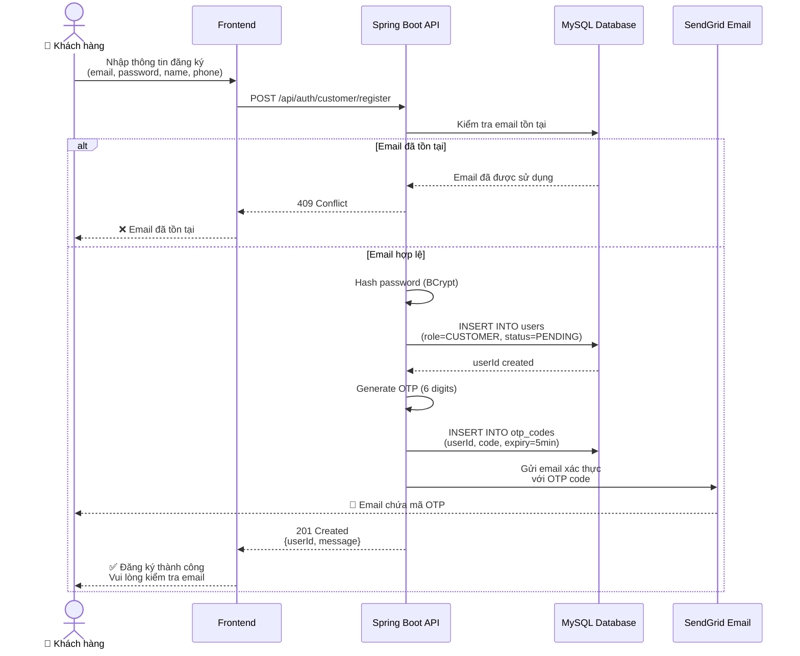
```mermaid
sequenceDiagram
    actor Customer as 👤 Khách hàng
    participant FE as Frontend
    participant Backend as Spring Boot API
    participant DB as MySQL Database
    participant Email as SendGrid Email

    Customer->>FE: Nhập thông tin đăng ký<br/>(email, password, name, phone)
    FE->>Backend: POST /api/auth/customer/register
    
    Backend->>DB: Kiểm tra email tồn tại
    alt Email đã tồn tại
        DB-->>Backend: Email đã được sử dụng
        Backend-->>FE: 409 Conflict
        FE-->>Customer: ❌ Email đã tồn tại
    else Email hợp lệ
        Backend->>Backend: Hash password (BCrypt)
        Backend->>DB: INSERT INTO users<br/>(role=CUSTOMER, status=PENDING)
        DB-->>Backend: userId created
        
        Backend->>Backend: Generate OTP (6 digits)
        Backend->>DB: INSERT INTO otp_codes<br/>(userId, code, expiry=5min)
        
        Backend->>Email: Gửi email xác thực<br/>với OTP code
        Email-->>Customer: 📧 Email chứa mã OTP
        
        Backend-->>FE: 201 Created<br/>{userId, message}
        FE-->>Customer: ✅ Đăng ký thành công<br/>Vui lòng kiểm tra email
    end
```

### 1.2. Xác thực OTP

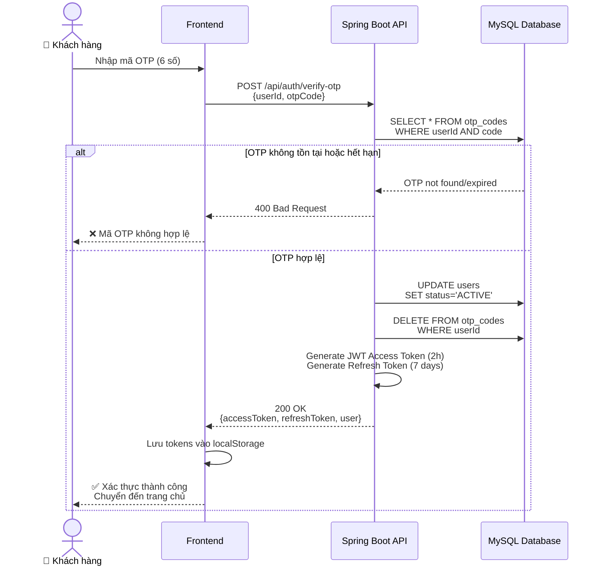
```mermaid
sequenceDiagram
    actor Customer as 👤 Khách hàng
    participant FE as Frontend
    participant Backend as Spring Boot API
    participant DB as MySQL Database

    Customer->>FE: Nhập mã OTP (6 số)
    FE->>Backend: POST /api/auth/verify-otp<br/>{userId, otpCode}
    
    Backend->>DB: SELECT * FROM otp_codes<br/>WHERE userId AND code
    
    alt OTP không tồn tại hoặc hết hạn
        DB-->>Backend: OTP not found/expired
        Backend-->>FE: 400 Bad Request
        FE-->>Customer: ❌ Mã OTP không hợp lệ
    else OTP hợp lệ
        Backend->>DB: UPDATE users<br/>SET status='ACTIVE'
        Backend->>DB: DELETE FROM otp_codes<br/>WHERE userId
        
        Backend->>Backend: Generate JWT Access Token (2h)<br/>Generate Refresh Token (7 days)
        
        Backend-->>FE: 200 OK<br/>{accessToken, refreshToken, user}
        FE->>FE: Lưu tokens vào localStorage
        FE-->>Customer: ✅ Xác thực thành công<br/>Chuyển đến trang chủ
    end
```

### 1.3. Đăng nhập Khách hàng

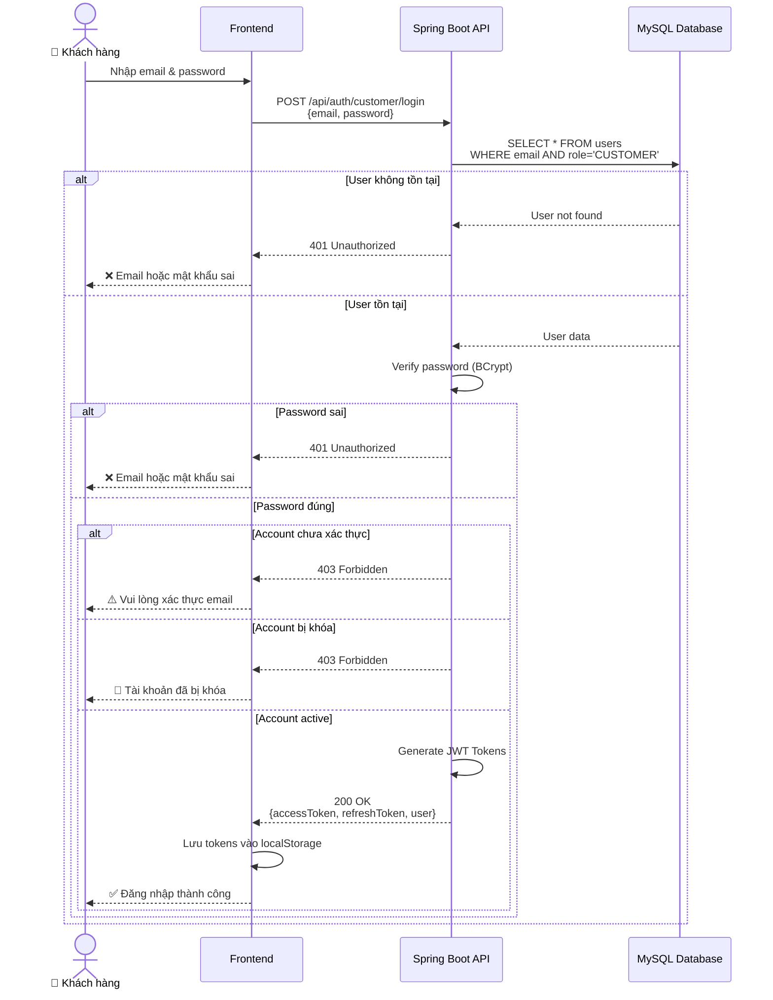
```mermaid
sequenceDiagram
    actor Customer as 👤 Khách hàng
    participant FE as Frontend
    participant Backend as Spring Boot API
    participant DB as MySQL Database

    Customer->>FE: Nhập email & password
    FE->>Backend: POST /api/auth/customer/login<br/>{email, password}
    
    Backend->>DB: SELECT * FROM users<br/>WHERE email AND role='CUSTOMER'
    
    alt User không tồn tại
        DB-->>Backend: User not found
        Backend-->>FE: 401 Unauthorized
        FE-->>Customer: ❌ Email hoặc mật khẩu sai
    else User tồn tại
        DB-->>Backend: User data
        Backend->>Backend: Verify password (BCrypt)
        
        alt Password sai
            Backend-->>FE: 401 Unauthorized
            FE-->>Customer: ❌ Email hoặc mật khẩu sai
        else Password đúng
            alt Account chưa xác thực
                Backend-->>FE: 403 Forbidden
                FE-->>Customer: ⚠️ Vui lòng xác thực email
            else Account bị khóa
                Backend-->>FE: 403 Forbidden
                FE-->>Customer: 🚫 Tài khoản đã bị khóa
            else Account active
                Backend->>Backend: Generate JWT Tokens
                Backend-->>FE: 200 OK<br/>{accessToken, refreshToken, user}
                FE->>FE: Lưu tokens vào localStorage
                FE-->>Customer: ✅ Đăng nhập thành công
            end
        end
    end
```

### 1.4. Đăng ký Nhà cung cấp (Supplier Registration)

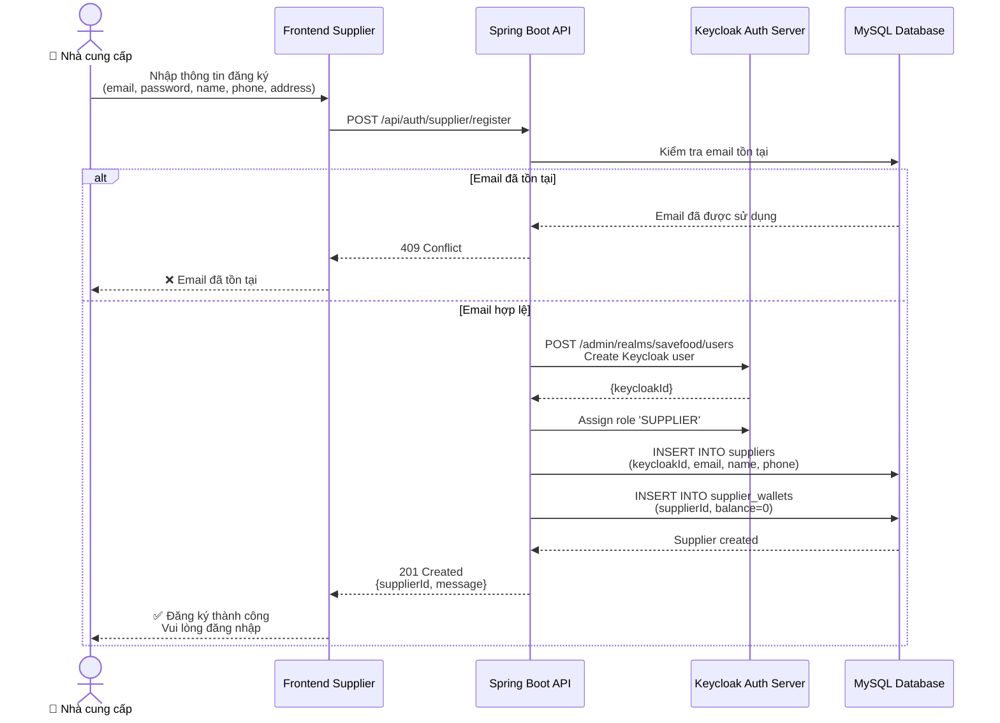
```mermaid
sequenceDiagram
    actor Supplier as 🏪 Nhà cung cấp
    participant FE as Frontend Supplier
    participant Backend as Spring Boot API
    participant Keycloak as Keycloak Auth Server
    participant DB as MySQL Database

    Supplier->>FE: Nhập thông tin đăng ký<br/>(email, password, name, phone, address)
    FE->>Backend: POST /api/auth/supplier/register
    
    Backend->>DB: Kiểm tra email tồn tại
    alt Email đã tồn tại
        DB-->>Backend: Email đã được sử dụng
        Backend-->>FE: 409 Conflict
        FE-->>Supplier: ❌ Email đã tồn tại
    else Email hợp lệ
        Backend->>Keycloak: POST /admin/realms/savefood/users<br/>Create Keycloak user
        Keycloak-->>Backend: {keycloakId}
        
        Backend->>Keycloak: Assign role 'SUPPLIER'
        
        Backend->>DB: INSERT INTO suppliers<br/>(keycloakId, email, name, phone)
        Backend->>DB: INSERT INTO supplier_wallets<br/>(supplierId, balance=0)
        
        DB-->>Backend: Supplier created
        Backend-->>FE: 201 Created<br/>{supplierId, message}
        FE-->>Supplier: ✅ Đăng ký thành công<br/>Vui lòng đăng nhập
    end
```

### 1.5. Đăng nhập Nhà cung cấp

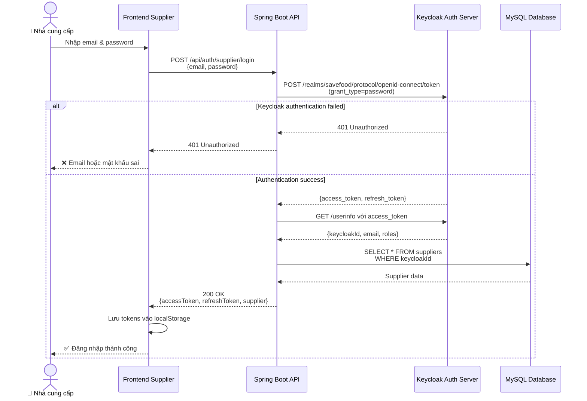
```mermaid
sequenceDiagram
    actor Supplier as 🏪 Nhà cung cấp
    participant FE as Frontend Supplier
    participant Backend as Spring Boot API
    participant Keycloak as Keycloak Auth Server
    participant DB as MySQL Database

    Supplier->>FE: Nhập email & password
    FE->>Backend: POST /api/auth/supplier/login<br/>{email, password}
    
    Backend->>Keycloak: POST /realms/savefood/protocol/openid-connect/token<br/>(grant_type=password)
    
    alt Keycloak authentication failed
        Keycloak-->>Backend: 401 Unauthorized
        Backend-->>FE: 401 Unauthorized
        FE-->>Supplier: ❌ Email hoặc mật khẩu sai
    else Authentication success
        Keycloak-->>Backend: {access_token, refresh_token}
        
        Backend->>Keycloak: GET /userinfo với access_token
        Keycloak-->>Backend: {keycloakId, email, roles}
        
        Backend->>DB: SELECT * FROM suppliers<br/>WHERE keycloakId
        DB-->>Backend: Supplier data
        
        Backend-->>FE: 200 OK<br/>{accessToken, refreshToken, supplier}
        FE->>FE: Lưu tokens vào localStorage
        FE-->>Supplier: ✅ Đăng nhập thành công
    end
```

---

## 2. Luồng quản lý sản phẩm (Nhà cung cấp)

### 2.1. Tạo sản phẩm mới

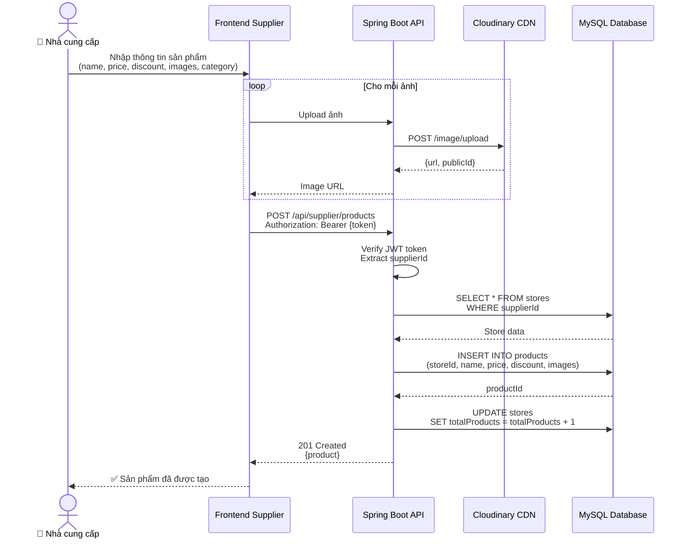
```mermaid
sequenceDiagram
    actor Supplier as 🏪 Nhà cung cấp
    participant FE as Frontend Supplier
    participant Backend as Spring Boot API
    participant Cloudinary as Cloudinary CDN
    participant DB as MySQL Database

    Supplier->>FE: Nhập thông tin sản phẩm<br/>(name, price, discount, images, category)
    
    loop Cho mỗi ảnh
        FE->>Backend: Upload ảnh
        Backend->>Cloudinary: POST /image/upload
        Cloudinary-->>Backend: {url, publicId}
        Backend-->>FE: Image URL
    end
    
    FE->>Backend: POST /api/supplier/products<br/>Authorization: Bearer {token}
    
    Backend->>Backend: Verify JWT token<br/>Extract supplierId
    
    Backend->>DB: SELECT * FROM stores<br/>WHERE supplierId
    DB-->>Backend: Store data
    
    Backend->>DB: INSERT INTO products<br/>(storeId, name, price, discount, images)
    DB-->>Backend: productId
    
    Backend->>DB: UPDATE stores<br/>SET totalProducts = totalProducts + 1
    
    Backend-->>FE: 201 Created<br/>{product}
    FE-->>Supplier: ✅ Sản phẩm đã được tạo
```

### 2.2. Cập nhật tồn kho sản phẩm

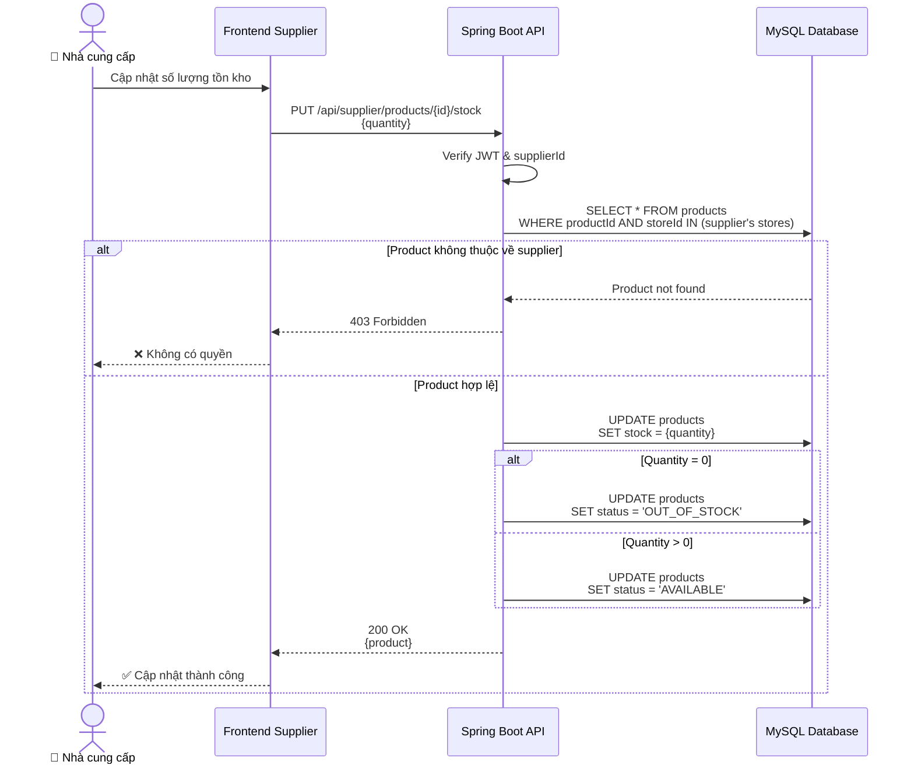
```mermaid
sequenceDiagram
    actor Supplier as 🏪 Nhà cung cấp
    participant FE as Frontend Supplier
    participant Backend as Spring Boot API
    participant DB as MySQL Database

    Supplier->>FE: Cập nhật số lượng tồn kho
    FE->>Backend: PUT /api/supplier/products/{id}/stock<br/>{quantity}
    
    Backend->>Backend: Verify JWT & supplierId
    
    Backend->>DB: SELECT * FROM products<br/>WHERE productId AND storeId IN (supplier's stores)
    
    alt Product không thuộc về supplier
        DB-->>Backend: Product not found
        Backend-->>FE: 403 Forbidden
        FE-->>Supplier: ❌ Không có quyền
    else Product hợp lệ
        Backend->>DB: UPDATE products<br/>SET stock = {quantity}
        
        alt Quantity = 0
            Backend->>DB: UPDATE products<br/>SET status = 'OUT_OF_STOCK'
        else Quantity > 0
            Backend->>DB: UPDATE products<br/>SET status = 'AVAILABLE'
        end
        
        Backend-->>FE: 200 OK<br/>{product}
        FE-->>Supplier: ✅ Cập nhật thành công
    end
```

---

## 3. Luồng mua hàng (Khách hàng)

### 3.1. Xem danh sách sản phẩm

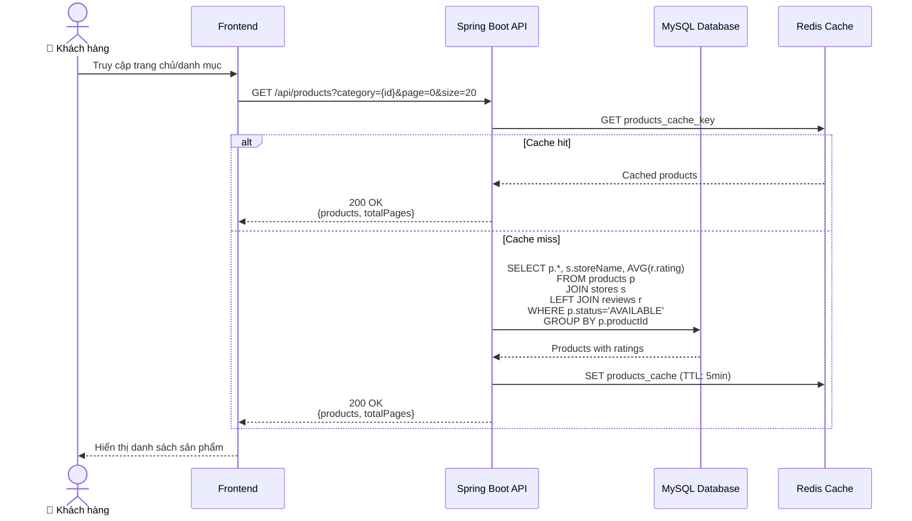
```mermaid
sequenceDiagram
    actor Customer as 👤 Khách hàng
    participant FE as Frontend
    participant Backend as Spring Boot API
    participant DB as MySQL Database
    participant Redis as Redis Cache

    Customer->>FE: Truy cập trang chủ/danh mục
    FE->>Backend: GET /api/products?category={id}&page=0&size=20
    
    Backend->>Redis: GET products_cache_key
    
    alt Cache hit
        Redis-->>Backend: Cached products
        Backend-->>FE: 200 OK<br/>{products, totalPages}
    else Cache miss
        Backend->>DB: SELECT p.*, s.storeName, AVG(r.rating)<br/>FROM products p<br/>JOIN stores s<br/>LEFT JOIN reviews r<br/>WHERE p.status='AVAILABLE'<br/>GROUP BY p.productId
        
        DB-->>Backend: Products with ratings
        Backend->>Redis: SET products_cache (TTL: 5min)
        Backend-->>FE: 200 OK<br/>{products, totalPages}
    end
    
    FE-->>Customer: Hiển thị danh sách sản phẩm
```

### 3.2. Thêm vào giỏ hàng

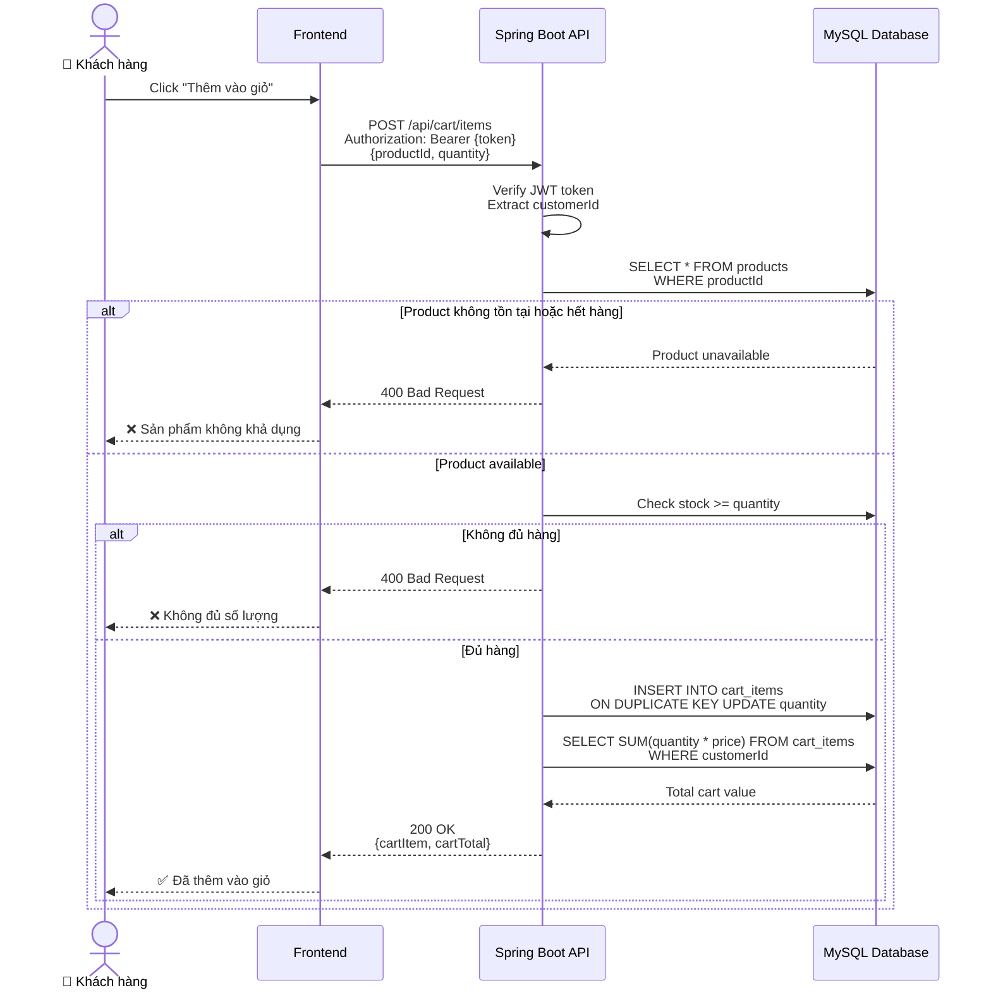
```mermaid
sequenceDiagram
    actor Customer as 👤 Khách hàng
    participant FE as Frontend
    participant Backend as Spring Boot API
    participant DB as MySQL Database

    Customer->>FE: Click "Thêm vào giỏ"
    FE->>Backend: POST /api/cart/items<br/>Authorization: Bearer {token}<br/>{productId, quantity}
    
    Backend->>Backend: Verify JWT token<br/>Extract customerId
    
    Backend->>DB: SELECT * FROM products<br/>WHERE productId
    
    alt Product không tồn tại hoặc hết hàng
        DB-->>Backend: Product unavailable
        Backend-->>FE: 400 Bad Request
        FE-->>Customer: ❌ Sản phẩm không khả dụng
    else Product available
        Backend->>DB: Check stock >= quantity
        
        alt Không đủ hàng
            Backend-->>FE: 400 Bad Request
            FE-->>Customer: ❌ Không đủ số lượng
        else Đủ hàng
            Backend->>DB: INSERT INTO cart_items<br/>ON DUPLICATE KEY UPDATE quantity
            
            Backend->>DB: SELECT SUM(quantity * price) FROM cart_items<br/>WHERE customerId
            DB-->>Backend: Total cart value
            
            Backend-->>FE: 200 OK<br/>{cartItem, cartTotal}
            FE-->>Customer: ✅ Đã thêm vào giỏ
        end
    end
```

### 3.3. Tạo đơn hàng (Checkout)

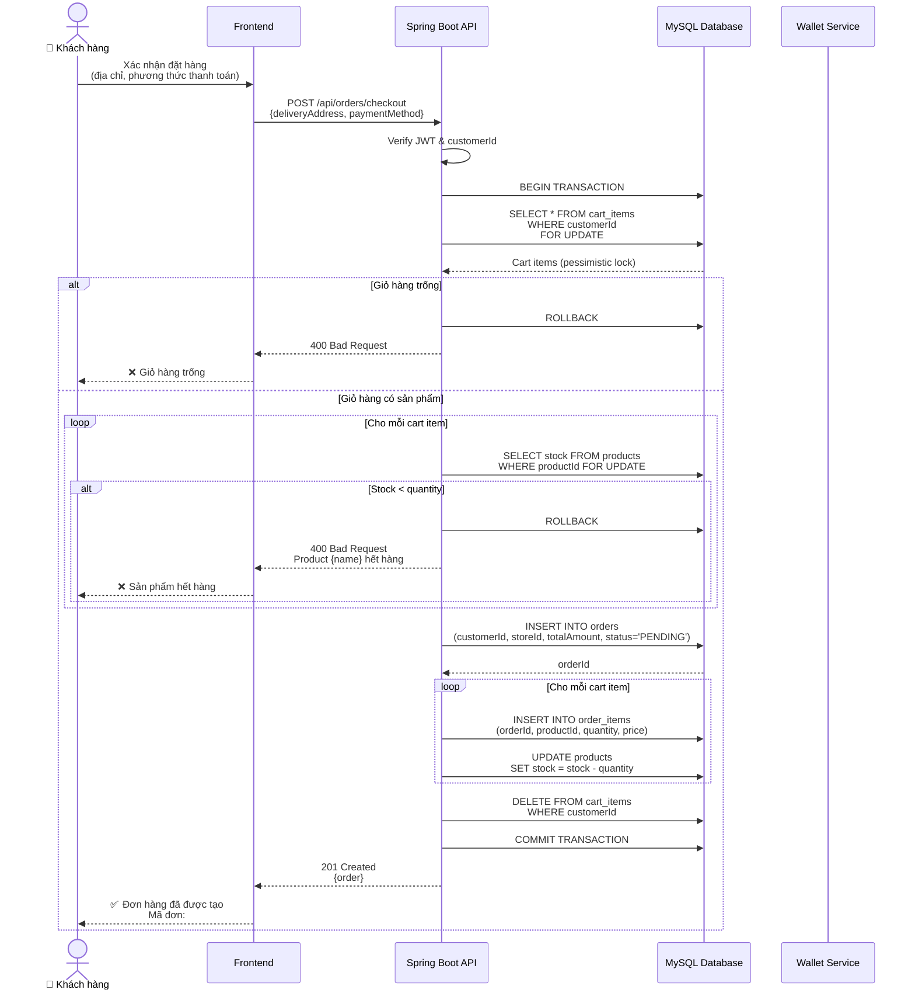
```mermaid
sequenceDiagram
    actor Customer as 👤 Khách hàng
    participant FE as Frontend
    participant Backend as Spring Boot API
    participant DB as MySQL Database
    participant Wallet as Wallet Service

    Customer->>FE: Xác nhận đặt hàng<br/>(địa chỉ, phương thức thanh toán)
    FE->>Backend: POST /api/orders/checkout<br/>{deliveryAddress, paymentMethod}
    
    Backend->>Backend: Verify JWT & customerId
    
    Backend->>DB: BEGIN TRANSACTION
    
    Backend->>DB: SELECT * FROM cart_items<br/>WHERE customerId<br/>FOR UPDATE
    DB-->>Backend: Cart items (pessimistic lock)
    
    alt Giỏ hàng trống
        Backend->>DB: ROLLBACK
        Backend-->>FE: 400 Bad Request
        FE-->>Customer: ❌ Giỏ hàng trống
    else Giỏ hàng có sản phẩm
        loop Cho mỗi cart item
            Backend->>DB: SELECT stock FROM products<br/>WHERE productId FOR UPDATE
            
            alt Stock < quantity
                Backend->>DB: ROLLBACK
                Backend-->>FE: 400 Bad Request<br/>Product {name} hết hàng
                FE-->>Customer: ❌ Sản phẩm hết hàng
            end
        end
        
        Backend->>DB: INSERT INTO orders<br/>(customerId, storeId, totalAmount, status='PENDING')
        DB-->>Backend: orderId
        
        loop Cho mỗi cart item
            Backend->>DB: INSERT INTO order_items<br/>(orderId, productId, quantity, price)
            Backend->>DB: UPDATE products<br/>SET stock = stock - quantity
        end
        
        Backend->>DB: DELETE FROM cart_items<br/>WHERE customerId
        
        Backend->>DB: COMMIT TRANSACTION
        
        Backend-->>FE: 201 Created<br/>{order}
        FE-->>Customer: ✅ Đơn hàng đã được tạo<br/>Mã đơn: #{orderCode}
    end
```

---

## 4. Luồng xử lý đơn hàng (Nhà cung cấp)

### 4.1. Xác nhận đơn hàng

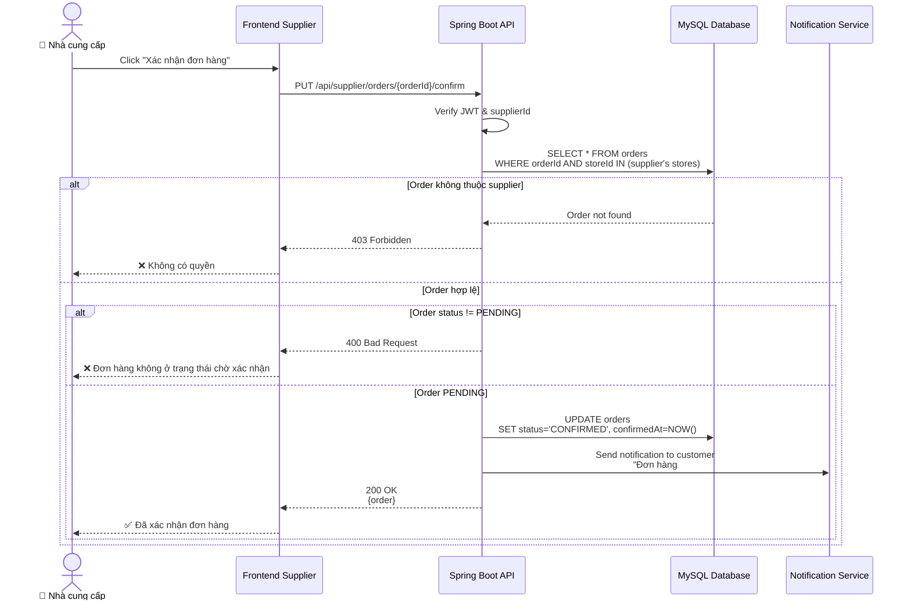
```mermaid
sequenceDiagram
    actor Supplier as 🏪 Nhà cung cấp
    participant FE as Frontend Supplier
    participant Backend as Spring Boot API
    participant DB as MySQL Database
    participant Notification as Notification Service

    Supplier->>FE: Click "Xác nhận đơn hàng"
    FE->>Backend: PUT /api/supplier/orders/{orderId}/confirm
    
    Backend->>Backend: Verify JWT & supplierId
    
    Backend->>DB: SELECT * FROM orders<br/>WHERE orderId AND storeId IN (supplier's stores)
    
    alt Order không thuộc supplier
        DB-->>Backend: Order not found
        Backend-->>FE: 403 Forbidden
        FE-->>Supplier: ❌ Không có quyền
    else Order hợp lệ
        alt Order status != PENDING
            Backend-->>FE: 400 Bad Request
            FE-->>Supplier: ❌ Đơn hàng không ở trạng thái chờ xác nhận
        else Order PENDING
            Backend->>DB: UPDATE orders<br/>SET status='CONFIRMED', confirmedAt=NOW()
            
            Backend->>Notification: Send notification to customer<br/>"Đơn hàng #{orderCode} đã được xác nhận"
            
            Backend-->>FE: 200 OK<br/>{order}
            FE-->>Supplier: ✅ Đã xác nhận đơn hàng
        end
    end
```

### 4.2. Cập nhật trạng thái giao hàng

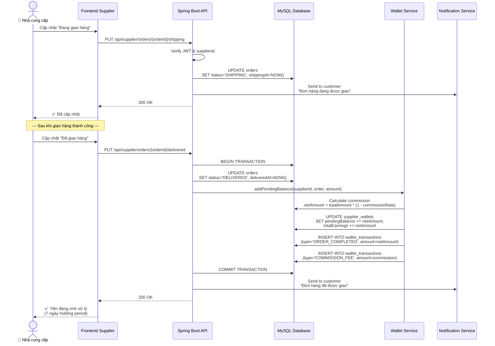
```mermaid
sequenceDiagram
    actor Supplier as 🏪 Nhà cung cấp
    participant FE as Frontend Supplier
    participant Backend as Spring Boot API
    participant DB as MySQL Database
    participant Wallet as Wallet Service
    participant Notification as Notification Service

    Supplier->>FE: Cập nhật "Đang giao hàng"
    FE->>Backend: PUT /api/supplier/orders/{orderId}/shipping
    
    Backend->>Backend: Verify JWT & supplierId
    
    Backend->>DB: UPDATE orders<br/>SET status='SHIPPING', shippingAt=NOW()
    
    Backend->>Notification: Send to customer<br/>"Đơn hàng đang được giao"
    
    Backend-->>FE: 200 OK
    FE-->>Supplier: ✅ Đã cập nhật
    
    Note over Supplier,FE: --- Sau khi giao hàng thành công ---
    
    Supplier->>FE: Cập nhật "Đã giao hàng"
    FE->>Backend: PUT /api/supplier/orders/{orderId}/delivered
    
    Backend->>DB: BEGIN TRANSACTION
    
    Backend->>DB: UPDATE orders<br/>SET status='DELIVERED', deliveredAt=NOW()
    
    Backend->>Wallet: addPendingBalance(supplierId, order, amount)
    
    Wallet->>DB: Calculate commission<br/>netAmount = totalAmount * (1 - commissionRate)
    
    Wallet->>DB: UPDATE supplier_wallets<br/>SET pendingBalance += netAmount,<br/>totalEarnings += netAmount
    
    Wallet->>DB: INSERT INTO wallet_transactions<br/>(type='ORDER_COMPLETED', amount=netAmount)
    
    Wallet->>DB: INSERT INTO wallet_transactions<br/>(type='COMMISSION_FEE', amount=commission)
    
    Backend->>DB: COMMIT TRANSACTION
    
    Backend->>Notification: Send to customer<br/>"Đơn hàng đã được giao"
    
    Backend-->>FE: 200 OK
    FE-->>Supplier: ✅ Tiền đang chờ xử lý<br/>(7 ngày holding period)
```

---

## 5. Luồng hủy đơn & hoàn tiền

### 5.1. Khách hàng hủy đơn (PENDING/CONFIRMED)

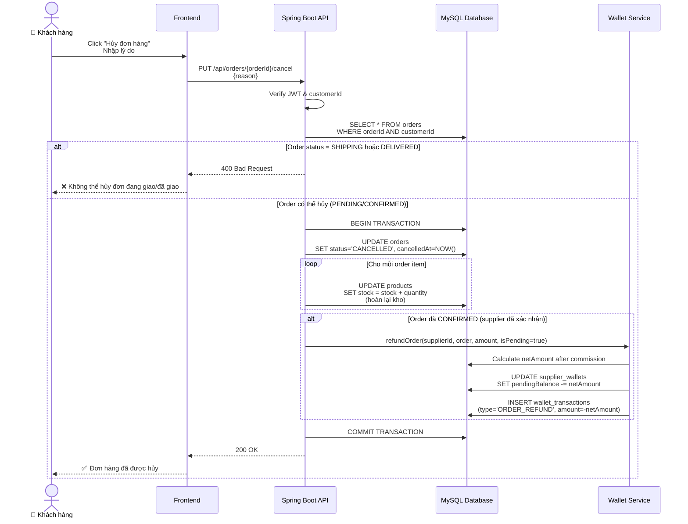
```mermaid
sequenceDiagram
    actor Customer as 👤 Khách hàng
    participant FE as Frontend
    participant Backend as Spring Boot API
    participant DB as MySQL Database
    participant Wallet as Wallet Service

    Customer->>FE: Click "Hủy đơn hàng"<br/>Nhập lý do
    FE->>Backend: PUT /api/orders/{orderId}/cancel<br/>{reason}
    
    Backend->>Backend: Verify JWT & customerId
    
    Backend->>DB: SELECT * FROM orders<br/>WHERE orderId AND customerId
    
    alt Order status = SHIPPING hoặc DELIVERED
        Backend-->>FE: 400 Bad Request
        FE-->>Customer: ❌ Không thể hủy đơn đang giao/đã giao
    else Order có thể hủy (PENDING/CONFIRMED)
        Backend->>DB: BEGIN TRANSACTION
        
        Backend->>DB: UPDATE orders<br/>SET status='CANCELLED', cancelledAt=NOW()
        
        loop Cho mỗi order item
            Backend->>DB: UPDATE products<br/>SET stock = stock + quantity<br/>(hoàn lại kho)
        end
        
        alt Order đã CONFIRMED (supplier đã xác nhận)
            Backend->>Wallet: refundOrder(supplierId, order, amount, isPending=true)
            
            Wallet->>DB: Calculate netAmount after commission
            Wallet->>DB: UPDATE supplier_wallets<br/>SET pendingBalance -= netAmount
            Wallet->>DB: INSERT wallet_transactions<br/>(type='ORDER_REFUND', amount=-netAmount)
        end
        
        Backend->>DB: COMMIT TRANSACTION
        
        Backend-->>FE: 200 OK
        FE-->>Customer: ✅ Đơn hàng đã được hủy
    end
```

### 5.2. Khách hàng yêu cầu hoàn trả (Đã giao)

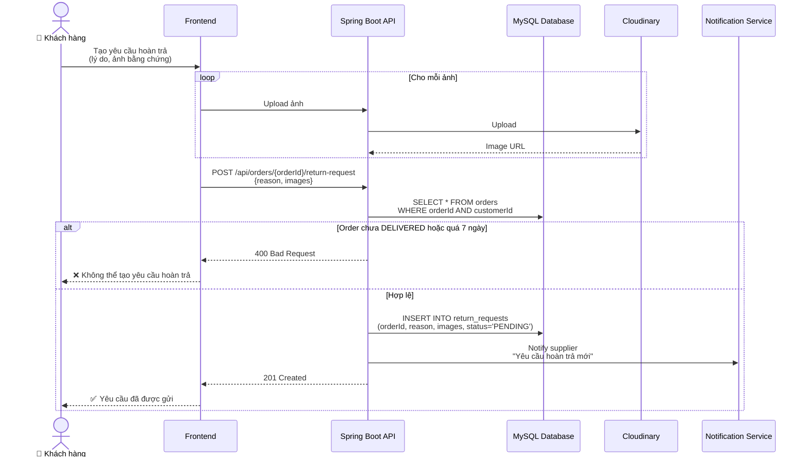
```mermaid
sequenceDiagram
    actor Customer as 👤 Khách hàng
    participant FE as Frontend
    participant Backend as Spring Boot API
    participant DB as MySQL Database
    participant Cloudinary as Cloudinary
    participant Notification as Notification Service

    Customer->>FE: Tạo yêu cầu hoàn trả<br/>(lý do, ảnh bằng chứng)
    
    loop Cho mỗi ảnh
        FE->>Backend: Upload ảnh
        Backend->>Cloudinary: Upload
        Cloudinary-->>Backend: Image URL
    end
    
    FE->>Backend: POST /api/orders/{orderId}/return-request<br/>{reason, images}
    
    Backend->>DB: SELECT * FROM orders<br/>WHERE orderId AND customerId
    
    alt Order chưa DELIVERED hoặc quá 7 ngày
        Backend-->>FE: 400 Bad Request
        FE-->>Customer: ❌ Không thể tạo yêu cầu hoàn trả
    else Hợp lệ
        Backend->>DB: INSERT INTO return_requests<br/>(orderId, reason, images, status='PENDING')
        
        Backend->>Notification: Notify supplier<br/>"Yêu cầu hoàn trả mới"
        
        Backend-->>FE: 201 Created
        FE-->>Customer: ✅ Yêu cầu đã được gửi
    end
```

### 5.3. Nhà cung cấp xử lý yêu cầu hoàn trả

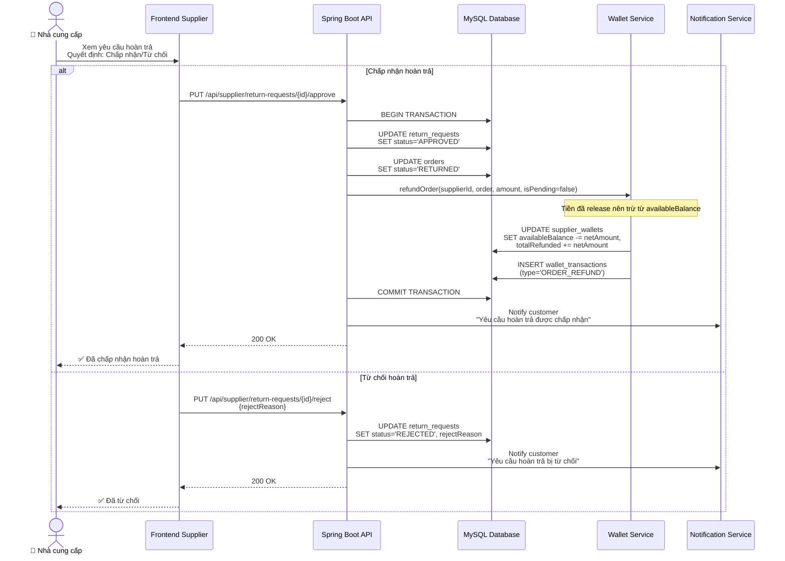
```mermaid
sequenceDiagram
    actor Supplier as 🏪 Nhà cung cấp
    participant FE as Frontend Supplier
    participant Backend as Spring Boot API
    participant DB as MySQL Database
    participant Wallet as Wallet Service
    participant Notification as Notification Service

    Supplier->>FE: Xem yêu cầu hoàn trả<br/>Quyết định: Chấp nhận/Từ chối
    
    alt Chấp nhận hoàn trả
        FE->>Backend: PUT /api/supplier/return-requests/{id}/approve
        
        Backend->>DB: BEGIN TRANSACTION
        
        Backend->>DB: UPDATE return_requests<br/>SET status='APPROVED'
        Backend->>DB: UPDATE orders<br/>SET status='RETURNED'
        
        Backend->>Wallet: refundOrder(supplierId, order, amount, isPending=false)
        
        Note over Wallet: Tiền đã release nên trừ từ availableBalance
        
        Wallet->>DB: UPDATE supplier_wallets<br/>SET availableBalance -= netAmount,<br/>totalRefunded += netAmount
        
        Wallet->>DB: INSERT wallet_transactions<br/>(type='ORDER_REFUND')
        
        Backend->>DB: COMMIT TRANSACTION
        
        Backend->>Notification: Notify customer<br/>"Yêu cầu hoàn trả được chấp nhận"
        
        Backend-->>FE: 200 OK
        FE-->>Supplier: ✅ Đã chấp nhận hoàn trả
        
    else Từ chối hoàn trả
        FE->>Backend: PUT /api/supplier/return-requests/{id}/reject<br/>{rejectReason}
        
        Backend->>DB: UPDATE return_requests<br/>SET status='REJECTED', rejectReason
        
        Backend->>Notification: Notify customer<br/>"Yêu cầu hoàn trả bị từ chối"
        
        Backend-->>FE: 200 OK
        FE-->>Supplier: ✅ Đã từ chối
    end
```

---

## 6. Luồng ví & thanh toán (Nhà cung cấp)

### 6.1. Giải phóng số dư (End-of-Day Release)

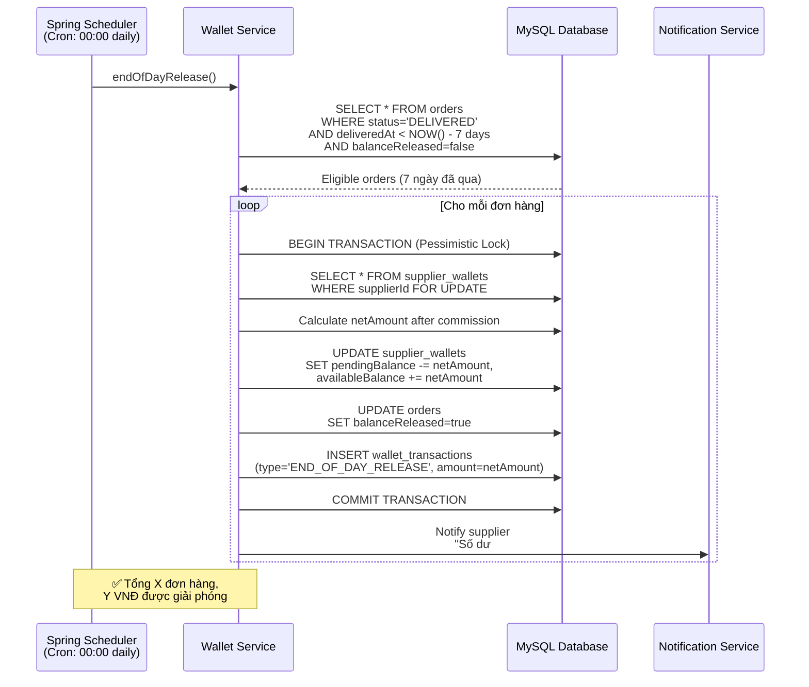
```mermaid
sequenceDiagram
    participant Scheduler as Spring Scheduler<br/>(Cron: 00:00 daily)
    participant Wallet as Wallet Service
    participant DB as MySQL Database
    participant Notification as Notification Service

    Scheduler->>Wallet: endOfDayRelease()
    
    Wallet->>DB: SELECT * FROM orders<br/>WHERE status='DELIVERED'<br/>AND deliveredAt < NOW() - 7 days<br/>AND balanceReleased=false
    
    DB-->>Wallet: Eligible orders (7 ngày đã qua)
    
    loop Cho mỗi đơn hàng
        Wallet->>DB: BEGIN TRANSACTION (Pessimistic Lock)
        
        Wallet->>DB: SELECT * FROM supplier_wallets<br/>WHERE supplierId FOR UPDATE
        
        Wallet->>DB: Calculate netAmount after commission
        
        Wallet->>DB: UPDATE supplier_wallets<br/>SET pendingBalance -= netAmount,<br/>availableBalance += netAmount
        
        Wallet->>DB: UPDATE orders<br/>SET balanceReleased=true
        
        Wallet->>DB: INSERT wallet_transactions<br/>(type='END_OF_DAY_RELEASE', amount=netAmount)
        
        Wallet->>DB: COMMIT TRANSACTION
        
        Wallet->>Notification: Notify supplier<br/>"Số dư #{orderCode} đã sẵn sàng rút"
    end
    
    Note over Scheduler,Wallet: ✅ Tổng X đơn hàng,<br/>Y VNĐ được giải phóng
```

### 6.2. Rút tiền cuối tháng (End-of-Month Withdrawal)

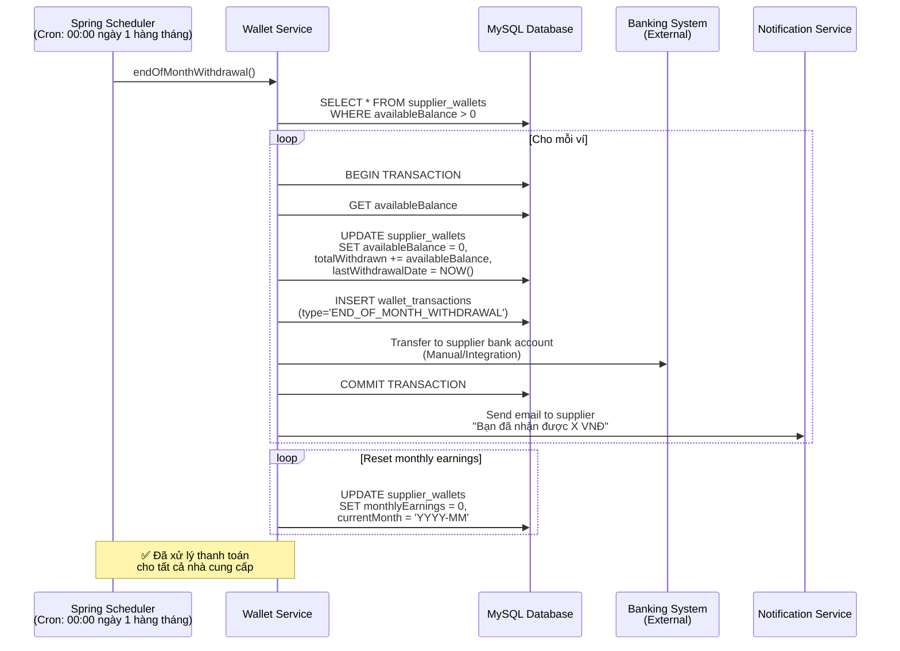
```mermaid
sequenceDiagram
    participant Scheduler as Spring Scheduler<br/>(Cron: 00:00 ngày 1 hàng tháng)
    participant Wallet as Wallet Service
    participant DB as MySQL Database
    participant Banking as Banking System<br/>(External)
    participant Notification as Notification Service

    Scheduler->>Wallet: endOfMonthWithdrawal()
    
    Wallet->>DB: SELECT * FROM supplier_wallets<br/>WHERE availableBalance > 0
    
    loop Cho mỗi ví
        Wallet->>DB: BEGIN TRANSACTION
        
        Wallet->>DB: GET availableBalance
        
        Wallet->>DB: UPDATE supplier_wallets<br/>SET availableBalance = 0,<br/>totalWithdrawn += availableBalance,<br/>lastWithdrawalDate = NOW()
        
        Wallet->>DB: INSERT wallet_transactions<br/>(type='END_OF_MONTH_WITHDRAWAL')
        
        Wallet->>Banking: Transfer to supplier bank account<br/>(Manual/Integration)
        
        Wallet->>DB: COMMIT TRANSACTION
        
        Wallet->>Notification: Send email to supplier<br/>"Bạn đã nhận được X VNĐ"
    end
    
    loop Reset monthly earnings
        Wallet->>DB: UPDATE supplier_wallets<br/>SET monthlyEarnings = 0,<br/>currentMonth = 'YYYY-MM'
    end
    
    Note over Scheduler,Wallet: ✅ Đã xử lý thanh toán<br/>cho tất cả nhà cung cấp
```

### 6.3. Xem lịch sử giao dịch

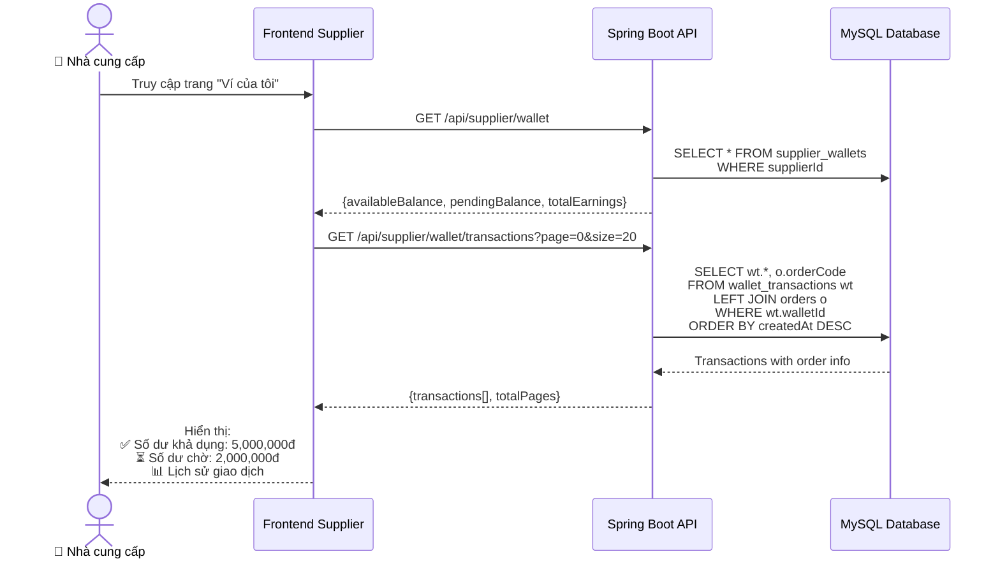
```mermaid
sequenceDiagram
    actor Supplier as 🏪 Nhà cung cấp
    participant FE as Frontend Supplier
    participant Backend as Spring Boot API
    participant DB as MySQL Database

    Supplier->>FE: Truy cập trang "Ví của tôi"
    
    FE->>Backend: GET /api/supplier/wallet
    Backend->>DB: SELECT * FROM supplier_wallets<br/>WHERE supplierId
    Backend-->>FE: {availableBalance, pendingBalance, totalEarnings}
    
    FE->>Backend: GET /api/supplier/wallet/transactions?page=0&size=20
    
    Backend->>DB: SELECT wt.*, o.orderCode<br/>FROM wallet_transactions wt<br/>LEFT JOIN orders o<br/>WHERE wt.walletId<br/>ORDER BY createdAt DESC
    
    DB-->>Backend: Transactions with order info
    Backend-->>FE: {transactions[], totalPages}
    
    FE-->>Supplier: Hiển thị:<br/>✅ Số dư khả dụng: 5,000,000đ<br/>⏳ Số dư chờ: 2,000,000đ<br/>📊 Lịch sử giao dịch
```

---

## 7. Luồng đánh giá sản phẩm

### 7.1. Khách hàng tạo đánh giá

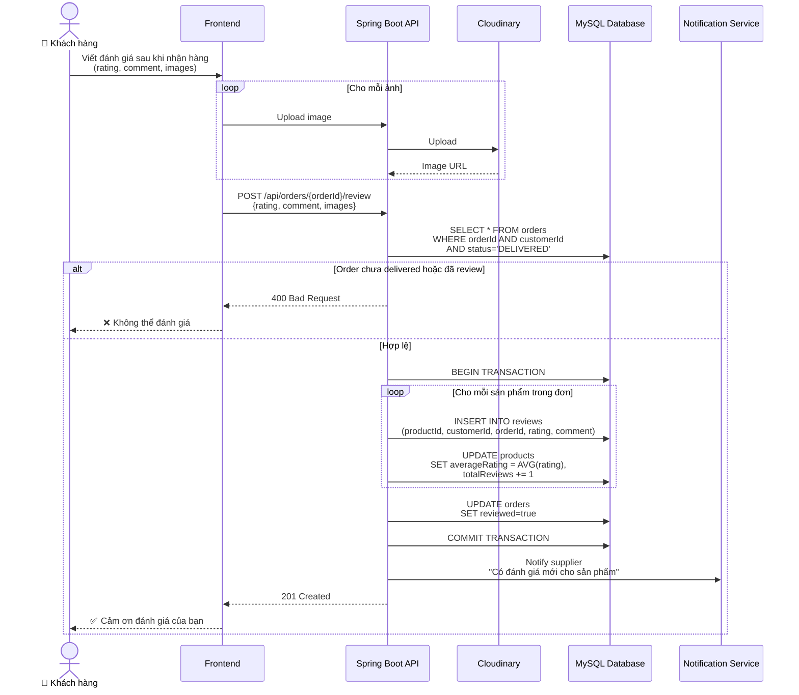
```mermaid
sequenceDiagram
    actor Customer as 👤 Khách hàng
    participant FE as Frontend
    participant Backend as Spring Boot API
    participant Cloudinary as Cloudinary
    participant DB as MySQL Database
    participant Notification as Notification Service

    Customer->>FE: Viết đánh giá sau khi nhận hàng<br/>(rating, comment, images)
    
    loop Cho mỗi ảnh
        FE->>Backend: Upload image
        Backend->>Cloudinary: Upload
        Cloudinary-->>Backend: Image URL
    end
    
    FE->>Backend: POST /api/orders/{orderId}/review<br/>{rating, comment, images}
    
    Backend->>DB: SELECT * FROM orders<br/>WHERE orderId AND customerId<br/>AND status='DELIVERED'
    
    alt Order chưa delivered hoặc đã review
        Backend-->>FE: 400 Bad Request
        FE-->>Customer: ❌ Không thể đánh giá
    else Hợp lệ
        Backend->>DB: BEGIN TRANSACTION
        
        loop Cho mỗi sản phẩm trong đơn
            Backend->>DB: INSERT INTO reviews<br/>(productId, customerId, orderId, rating, comment)
            
            Backend->>DB: UPDATE products<br/>SET averageRating = AVG(rating),<br/>totalReviews += 1
        end
        
        Backend->>DB: UPDATE orders<br/>SET reviewed=true
        
        Backend->>DB: COMMIT TRANSACTION
        
        Backend->>Notification: Notify supplier<br/>"Có đánh giá mới cho sản phẩm"
        
        Backend-->>FE: 201 Created
        FE-->>Customer: ✅ Cảm ơn đánh giá của bạn
    end
```

### 7.2. Nhà cung cấp phản hồi đánh giá

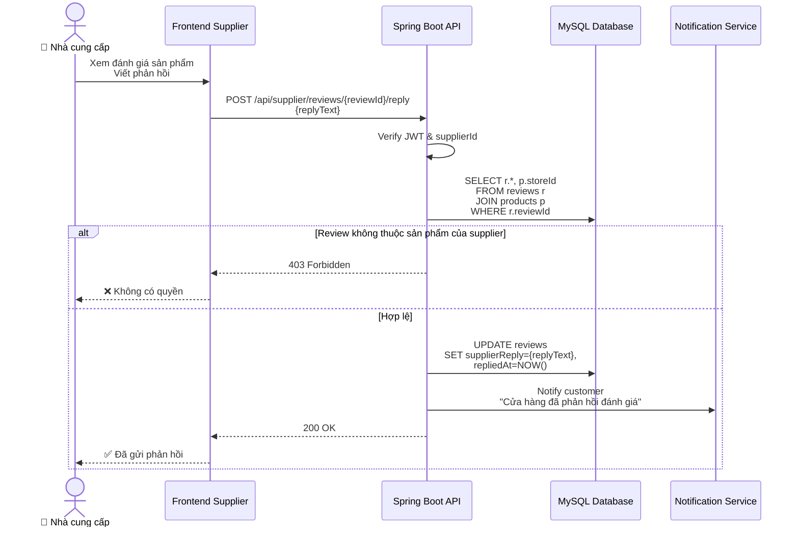
```mermaid
sequenceDiagram
    actor Supplier as 🏪 Nhà cung cấp
    participant FE as Frontend Supplier
    participant Backend as Spring Boot API
    participant DB as MySQL Database
    participant Notification as Notification Service

    Supplier->>FE: Xem đánh giá sản phẩm<br/>Viết phản hồi
    FE->>Backend: POST /api/supplier/reviews/{reviewId}/reply<br/>{replyText}
    
    Backend->>Backend: Verify JWT & supplierId
    
    Backend->>DB: SELECT r.*, p.storeId<br/>FROM reviews r<br/>JOIN products p<br/>WHERE r.reviewId
    
    alt Review không thuộc sản phẩm của supplier
        Backend-->>FE: 403 Forbidden
        FE-->>Supplier: ❌ Không có quyền
    else Hợp lệ
        Backend->>DB: UPDATE reviews<br/>SET supplierReply={replyText},<br/>repliedAt=NOW()
        
        Backend->>Notification: Notify customer<br/>"Cửa hàng đã phản hồi đánh giá"
        
        Backend-->>FE: 200 OK
        FE-->>Supplier: ✅ Đã gửi phản hồi
    end
```

---

## 8. Luồng chat thời gian thực

### 8.1. Khách hàng chat với nhà cung cấp

```mermaid
sequenceDiagram
    actor Customer as 👤 Khách hàng
    participant FE as Frontend
    participant Backend as Spring Boot API
    participant DB as MySQL Database
    participant WebSocket as WebSocket Server

    Customer->>FE: Click "Chat với cửa hàng"
    FE->>Backend: POST /api/conversations<br/>{supplierId}
    
    Backend->>DB: SELECT * FROM conversations<br/>WHERE customerId AND supplierId
    
    alt Conversation đã tồn tại
        DB-->>Backend: Existing conversation
    else Conversation mới
        Backend->>DB: INSERT INTO conversations<br/>(customerId, supplierId, status='ACTIVE')
        DB-->>Backend: conversationId
    end
    
    Backend-->>FE: {conversationId}
    
    FE->>WebSocket: CONNECT ws://backend/ws/chat<br/>?token={jwt}
    WebSocket-->>FE: Connected
    
    FE->>WebSocket: SUBSCRIBE /topic/conversation/{conversationId}
    
    Customer->>FE: Nhập tin nhắn
    FE->>WebSocket: SEND /app/chat.sendMessage<br/>{conversationId, message}
    
    WebSocket->>Backend: Handle message
    Backend->>DB: INSERT INTO messages<br/>(conversationId, senderId, message, type='TEXT')
    
    Backend->>DB: UPDATE conversations<br/>SET lastMessage, lastMessageAt, unreadCount
    
    Backend->>WebSocket: Broadcast to /topic/conversation/{conversationId}
    
    WebSocket-->>FE: New message event
    FE-->>Customer: Hiển thị tin nhắn đã gửi
    
    Note over WebSocket: Nếu supplier đang online
    WebSocket-->>FE: Notify supplier's FE
```

---

## 9. Luồng báo cáo vi phạm

### 9.1. Khách hàng báo cáo đánh giá vi phạm

```mermaid
sequenceDiagram
    actor Customer as 👤 Khách hàng
    participant FE as Frontend
    participant Backend as Spring Boot API
    participant DB as MySQL Database
    participant Admin as Admin Dashboard

    Customer->>FE: Click "Báo cáo đánh giá"<br/>Chọn lý do, mô tả
    FE->>Backend: POST /api/reviews/{reviewId}/report<br/>{reason, description}
    
    Backend->>Backend: Verify JWT & customerId
    
    Backend->>DB: INSERT INTO review_reports<br/>(reviewId, reporterId, reason, status='PENDING')
    
    Backend->>Admin: Notify admin<br/>"Có báo cáo vi phạm mới"
    
    Backend-->>FE: 201 Created
    FE-->>Customer: ✅ Đã gửi báo cáo
```

### 9.2. Admin xử lý báo cáo

```mermaid
sequenceDiagram
    actor Admin as 👨‍💼 Admin
    participant FE as Admin Dashboard
    participant Backend as Spring Boot API
    participant Keycloak as Keycloak
    participant DB as MySQL Database
    participant Notification as Notification Service

    Admin->>FE: Xem danh sách báo cáo
    FE->>Backend: GET /api/admin/reports?status=PENDING
    
    Backend->>Keycloak: Verify admin JWT token
    Backend->>DB: SELECT rr.*, r.*, u.name<br/>FROM review_reports rr<br/>JOIN reviews r<br/>JOIN users u
    
    DB-->>Backend: Reports with details
    Backend-->>FE: {reports[]}
    
    Admin->>FE: Xem chi tiết → Quyết định xử lý
    
    alt Xóa đánh giá vi phạm
        FE->>Backend: DELETE /api/admin/reviews/{reviewId}
        
        Backend->>DB: BEGIN TRANSACTION
        
        Backend->>DB: UPDATE reviews<br/>SET status='DELETED', deletedBy='ADMIN'
        
        Backend->>DB: UPDATE review_reports<br/>SET status='RESOLVED'
        
        Backend->>DB: COMMIT TRANSACTION
        
        Backend->>Notification: Notify reviewer<br/>"Đánh giá bị xóa do vi phạm"
        
        Backend-->>FE: 200 OK
        FE-->>Admin: ✅ Đã xóa đánh giá
        
    else Từ chối báo cáo
        FE->>Backend: PUT /api/admin/reports/{reportId}/reject
        
        Backend->>DB: UPDATE review_reports<br/>SET status='REJECTED'
        
        Backend->>Notification: Notify reporter<br/>"Báo cáo không hợp lệ"
        
        Backend-->>FE: 200 OK
        FE-->>Admin: ✅ Đã từ chối báo cáo
    end
```

---

## Tổng kết luồng hệ thống

### Các tác nhân chính:
1. **👤 Khách hàng (Customer)**: 
   - Đăng ký/Đăng nhập (JWT custom)
   - Xem sản phẩm, thêm giỏ hàng
   - Đặt hàng, thanh toán
   - Hủy đơn, yêu cầu hoàn trả
   - Đánh giá sản phẩm
   - Chat với nhà cung cấp

2. **🏪 Nhà cung cấp (Supplier)**:
   - Đăng ký/Đăng nhập (Keycloak)
   - Quản lý sản phẩm & kho
   - Xử lý đơn hàng
   - Phản hồi đánh giá
   - Quản lý ví & rút tiền
   - Chat với khách hàng

3. **👨‍💼 Admin**:
   - Đăng nhập (Keycloak)
   - Quản lý người dùng
   - Xử lý báo cáo vi phạm
   - Theo dõi hệ thống

### Công nghệ sử dụng:
- **Backend**: Spring Boot 3.5.6, Java 21
- **Database**: MySQL 8.4.6 (AWS RDS)
- **Auth**: Keycloak 25.0.6 (Supplier/Admin) + Custom JWT (Customer)
- **Cache**: Redis (Upstash)
- **Storage**: Cloudinary CDN
- **Email**: SendGrid
- **Real-time**: WebSocket (STOMP)
- **Deployment**: Render.com (Docker)
