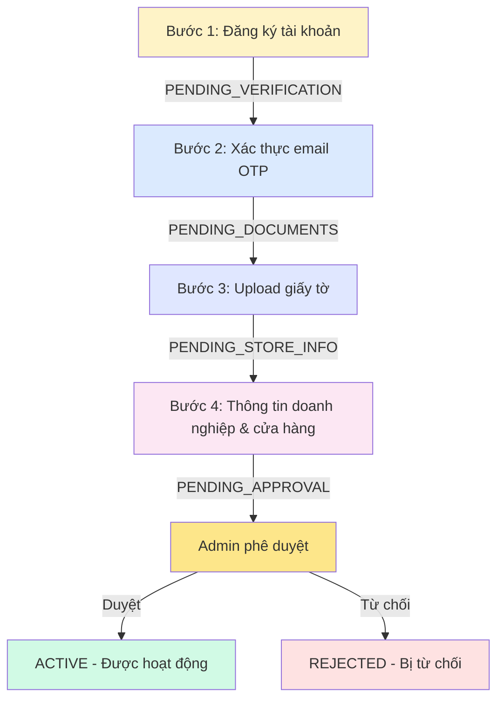
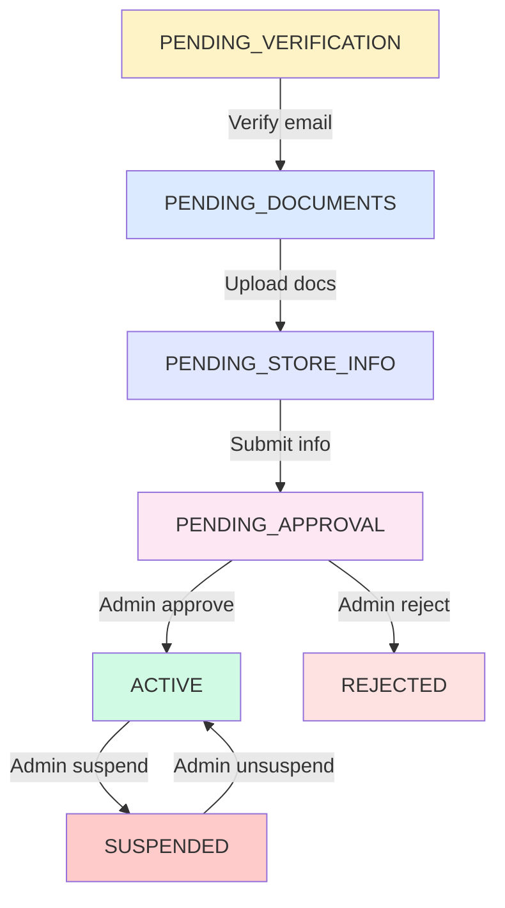

# 📋 NGHIỆP VỤ VÀ LUỒNG HOẠT ĐỘNG CỦA NHÀ CUNG CẤP

## 📑 Mục Lục

1. [Tổng Quan Hệ Thống](#1-tổng-quan-hệ-thống)
2. [Quy Trình Đăng Ký (4 Bước)](#2-quy-trình-đăng-ký-4-bước)
3. [Quản Lý Hồ Sơ](#3-quản-lý-hồ-sơ)
4. [Quản Lý Cửa Hàng](#4-quản-lý-cửa-hàng)
5. [Quản Lý Sản Phẩm](#5-quản-lý-sản-phẩm)
6. [Quản Lý Đơn Hàng](#6-quản-lý-đơn-hàng)
7. [Quản Lý Tài Chính](#7-quản-lý-tài-chính)
8. [Trạng Thái Nhà Cung Cấp](#8-trạng-thái-nhà-cung-cấp)
9. [Thống Kê Và Báo Cáo](#9-thống-kê-và-báo-cáo)

---

## 1. TỔNG QUAN HỆ THỐNG

### 1.1. Vai Trò Nhà Cung Cấp

Nhà cung cấp (Supplier) là người/tổ chức cung cấp sản phẩm thực phẩm thông qua nền tảng SaveFood.

**Quyền hạn:**
- ✅ Quản lý thông tin doanh nghiệp
- ✅ Tạo và quản lý cửa hàng
- ✅ Đăng bán sản phẩm
- ✅ Xử lý đơn hàng
- ✅ Theo dõi doanh thu và rút tiền
- ✅ Xem thống kê và báo cáo

**Giới hạn:**
- ❌ Không thể xem thông tin nhà cung cấp khác
- ❌ Không thể truy cập chức năng admin
- ❌ Phải tuân thủ chính sách và quy định nền tảng

### 1.2. Loại Hình Doanh Nghiệp

```typescript
export type BusinessType =
  | 'RESTAURANT'          // Nhà hàng
  | 'GROCERY_STORE'       // Cửa hàng tạp hóa
  | 'COFFEE_SHOP'         // Quán cà phê
  | 'BAKERY'              // Tiệm bánh
  | 'SUPERMARKET'         // Siêu thị
  | 'CONVENIENCE_STORE'   // Cửa hàng tiện lợi
  | 'DISTRIBUTOR'         // Nhà phân phối
  | 'OTHER';              // Khác
```

---

## 2. QUY TRÌNH ĐĂNG KÝ (4 BƯỚC)

### 🔹 BƯỚC 1: Đăng Ký Tài Khoản

**Mục đích:** Tạo tài khoản cơ bản trong hệ thống

**API Endpoint:**
```
POST /api/auth/register/supplier/step1
```

**Thông tin cần nhập:**
```typescript
{
  username: string;        // Tên đăng nhập (unique)
  email: string;           // Email (unique)
  fullName: string;        // Họ tên người đại diện
  phoneNumber: string;     // Số điện thoại
  password: string;        // Mật khẩu (tối thiểu 8 ký tự)
}
```

**Quy trình xử lý:**
```
1. Kiểm tra username/email chưa tồn tại
2. Tạo tài khoản trong Keycloak
3. Tạo record Supplier trong database
4. Gửi OTP về email
5. Trả về supplierId (UUID) để dùng cho các bước sau
```

**Trạng thái sau bước 1:** `PENDING_VERIFICATION`

**Response:**
```json
{
  "success": true,
  "data": {
    "userId": "550e8400-e29b-41d4-a716-446655440000",
    "username": "supplier001",
    "email": "supplier@example.com",
    "status": "PENDING_VERIFICATION",
    "message": "Registration successful. Please verify your email."
  }
}
```

---

### 🔹 BƯỚC 2: Xác Thực Email

**Mục đích:** Xác nhận email hợp lệ bằng mã OTP

**API Endpoint:**
```
POST /api/auth/register/supplier/step2
```

**Thông tin cần nhập:**
```typescript
{
  supplierId: string;  // UUID từ bước 1
  email: string;       // Email đã đăng ký
  otp: string;         // Mã OTP 6 số nhận qua email
}
```

**Quy trình xử lý:**
```
1. Kiểm tra supplier tồn tại và đang ở trạng thái PENDING_VERIFICATION
2. Xác thực OTP từ OtpService
3. Nếu đúng:
   - Đánh dấu email đã xác thực
   - Chuyển trạng thái sang PENDING_DOCUMENTS
   - Gửi email chúc mừng
4. Nếu sai:
   - Trả về lỗi
   - Cho phép thử lại (tối đa 5 lần)
```

**Trạng thái sau bước 2:** `PENDING_DOCUMENTS`

**Gửi lại OTP:**
```
POST /api/auth/register/supplier/resend-otp?supplierId={id}
```

---

### 🔹 BƯỚC 3: Tải Lên Giấy Tờ

**Mục đích:** Upload giấy phép kinh doanh và chứng nhận ATTP

**API Endpoint:**
```
POST /api/auth/register/supplier/step3
```

**Thông tin cần nhập:**
```typescript
{
  supplierId: string;
  email: string;
  businessLicense: string;          // Số giấy phép kinh doanh
  businessLicenseUrl: string;       // URL file PDF/Image (đã upload lên Cloudinary)
  foodSafetyCertificate: string;    // Số chứng nhận ATTP
  foodSafetyCertificateUrl: string; // URL file PDF/Image
  avatarUrl?: string;               // Logo cửa hàng (optional)
}
```

**Quy trình xử lý:**
```
1. Kiểm tra supplier đang ở trạng thái PENDING_DOCUMENTS
2. Validate:
   - businessLicenseUrl: bắt buộc
   - businessLicense: bắt buộc (số giấy phép)
   - foodSafetyCertificateUrl: bắt buộc
   - foodSafetyCertificate: bắt buộc (số chứng nhận)
3. Lưu thông tin vào database
4. Chuyển trạng thái sang PENDING_STORE_INFO
```

**Trạng thái sau bước 3:** `PENDING_STORE_INFO`

**Yêu cầu file:**
- Format: PDF hoặc JPG/PNG
- Kích thước: < 5MB
- Phải rõ ràng, không mờ
- Upload lên Cloudinary trước khi gọi API

---

### 🔹 BƯỚC 4: Thông Tin Doanh Nghiệp & Cửa Hàng Đầu Tiên

**Mục đích:** Hoàn tất đăng ký với thông tin doanh nghiệp và tạo cửa hàng đầu tiên

**API Endpoint:**
```
POST /api/auth/register/supplier/step4
```

**Thông tin cần nhập:**
```typescript
{
  supplierId: string;
  email: string;
  
  // Thông tin doanh nghiệp
  businessName: string;           // Tên doanh nghiệp
  businessAddress: string;        // Địa chỉ doanh nghiệp
  taxCode: string;                // Mã số thuế (10-13 số)
  businessType: BusinessType;     // Loại hình kinh doanh
  
  // Thông tin cửa hàng đầu tiên
  storeName: string;              // Tên cửa hàng
  storeAddress: string;           // Địa chỉ đầy đủ
  storeStreet: string;            // Số nhà, đường
  storeWard: string;              // Phường/Xã
  storeDistrict: string;          // Quận/Huyện
  storeProvince: string;          // Tỉnh/Thành phố
  storePhoneNumber: string;       // SĐT cửa hàng
  latitude: string;               // Vĩ độ
  longitude: string;              // Kinh độ
  storeDescription?: string;      // Mô tả cửa hàng (optional)
}
```

**Quy trình xử lý:**
```
1. Kiểm tra supplier đang ở trạng thái PENDING_STORE_INFO
2. Validate:
   - businessName: bắt buộc
   - businessAddress: bắt buộc
   - taxCode: bắt buộc, format 10-13 số
   - businessType: bắt buộc
   - Tất cả thông tin cửa hàng: bắt buộc
3. Lưu thông tin doanh nghiệp vào Supplier
4. Tạo Store đầu tiên:
   - Trạng thái: PENDING (chờ admin duyệt)
   - Tự động gắn với supplier
5. Chuyển trạng thái supplier sang PENDING_APPROVAL
6. Gửi notification cho tất cả admin
7. Tạo Wallet cho supplier
```

**Trạng thái sau bước 4:** `PENDING_APPROVAL`

**Notification gửi cho Admin:**
```
"Nhà cung cấp mới '[businessName]' đã hoàn thành đăng ký và đang chờ phê duyệt."
Link: /partners/pending
```

---

### 📊 Sơ Đồ Luồng Đăng Ký



---

## 3. QUẢN LÝ HỒ SƠ

### 3.1. Xem Thông Tin Hồ Sơ

**API Endpoint:**
```
GET /api/suppliers/me
Authorization: Bearer {access_token}
```

**Response:**
```json
{
  "success": true,
  "data": {
    "userId": "550e8400-e29b-41d4-a716-446655440000",
    "username": "supplier001",
    "email": "supplier@example.com",
    "phoneNumber": "0901234567",
    "fullName": "Nguyễn Văn A",
    "gender": "MALE",
    "avatarUrl": "https://cloudinary.com/...",
    "businessName": "Cửa Hàng Thực Phẩm Sạch A",
    "businessType": "GROCERY_STORE",
    "businessAddress": "123 Đường ABC, Quận 1, TP.HCM",
    "taxCode": "0123456789",
    "businessLicense": "GP-123456",
    "businessLicenseUrl": "https://cloudinary.com/...",
    "foodSafetyCertificate": "ATTP-789012",
    "foodSafetyCertificateUrl": "https://cloudinary.com/...",
    "status": "ACTIVE",
    "commissionRate": 5.0,
    "wallet": {
      "walletId": "...",
      "balance": 5000000,
      "pendingBalance": 250000
    },
    "stores": [
      {
        "storeId": "...",
        "storeName": "Chi Nhánh 1",
        "status": "ACTIVE",
        "totalProducts": 45
      }
    ],
    "totalProducts": 120,
    "totalStores": 3,
    "createdAt": "2024-01-01T10:00:00",
    "updatedAt": "2025-01-05T15:30:00"
  }
}
```

---

### 3.2. Cập Nhật Thông Tin Cơ Bản

**API Endpoint:**
```
PATCH /api/suppliers/me
Authorization: Bearer {access_token}
```

**Thông tin có thể cập nhật:**
```typescript
{
  fullName?: string;        // Họ tên
  phoneNumber?: string;     // Số điện thoại
  gender?: 'MALE' | 'FEMALE' | 'OTHER';
  avatarUrl?: string;       // Ảnh đại diện
  businessAddress?: string; // Địa chỉ doanh nghiệp
}
```

**Đặc điểm:**
- ✅ Cập nhật trực tiếp, không cần duyệt
- ✅ Gửi notification cho admin về thay đổi
- ❌ Không thể thay đổi username, email
- ❌ Không thể thay đổi thông tin nhạy cảm (mã số thuế, giấy phép)

---

### 3.3. Yêu Cầu Cập Nhật Thông Tin Nhạy Cảm

**Thông tin nhạy cảm cần admin phê duyệt:**
- Mã số thuế (taxCode)
- Số giấy phép kinh doanh (businessLicense)
- File giấy phép kinh doanh (businessLicenseUrl)
- Số chứng nhận ATTP (foodSafetyCertificate)
- File chứng nhận ATTP (foodSafetyCertificateUrl)

**API Endpoint:**
```
POST /api/suppliers/me/business-info-update
Authorization: Bearer {access_token}
```

**Request Body:**
```typescript
{
  taxCode?: string;
  businessLicense?: string;
  businessLicenseUrl?: string;
  foodSafetyCertificate?: string;
  foodSafetyCertificateUrl?: string;
  supplierNotes?: string;  // Ghi chú lý do cập nhật
}
```

**Quy trình:**
```
1. Supplier tạo yêu cầu cập nhật
   → Tạo PendingUpdate với entityType=SUPPLIER
   → Status: PENDING

2. Admin nhận notification và xem xét

3. Admin phê duyệt hoặc từ chối:
   
   A. Phê duyệt (APPROVE):
      POST /api/suppliers/business-info-updates/{updateId}/approve
      → Áp dụng thay đổi vào Supplier
      → Status: APPROVED
      → Gửi notification cho supplier
   
   B. Từ chối (REJECT):
      POST /api/suppliers/business-info-updates/{updateId}/reject
      Body: { adminNotes: "Lý do từ chối" }
      → Không áp dụng thay đổi
      → Status: REJECTED
      → Gửi notification kèm lý do
```

**Xem lịch sử yêu cầu:**
```
GET /api/suppliers/me/business-info-updates?status=PENDING&page=0&size=10
```

**Response:**
```json
{
  "success": true,
  "data": {
    "content": [
      {
        "updateId": "...",
        "supplierId": "...",
        "supplierName": "Nguyễn Văn A",
        "currentBusinessName": "Cửa Hàng A",
        "currentTaxCode": "0123456789",
        "taxCode": "0123456790",  // Mã số thuế mới
        "supplierNotes": "Đổi mã số thuế do thay đổi giấy phép",
        "updateStatus": "PENDING",
        "createdAt": "2025-01-05T10:00:00",
        "adminNotes": null,
        "processedAt": null
      }
    ],
    "totalElements": 1,
    "totalPages": 1
  }
}
```

---

### 3.4. Đổi Mật Khẩu

**API Endpoint:**
```
POST /api/auth/change-password
Authorization: Bearer {access_token}
```

**Request Body:**
```typescript
{
  currentPassword: string;  // Mật khẩu hiện tại
  newPassword: string;      // Mật khẩu mới (min 8 ký tự)
}
```

**Quy trình:**
```
1. Xác thực mật khẩu hiện tại với Keycloak
2. Kiểm tra mật khẩu mới:
   - Tối thiểu 8 ký tự
   - Khác với mật khẩu cũ
3. Cập nhật trong Keycloak
4. Trả về thành công
```

---

## 4. QUẢN LÝ CỬA HÀNG

### 4.1. Danh Sách Cửa Hàng

**API Endpoint:**
```
GET /api/stores/my-stores?page=0&size=10&status=ACTIVE
Authorization: Bearer {access_token}
```

**Query Parameters:**
- `page`: Trang hiện tại (default: 0)
- `size`: Số lượng/trang (default: 10)
- `status`: Lọc theo trạng thái (optional)

**Response:**
```json
{
  "success": true,
  "data": {
    "content": [
      {
        "storeId": "...",
        "storeName": "Chi Nhánh Quận 1",
        "address": "123 Đường ABC, Quận 1, TP.HCM",
        "phoneNumber": "0287654321",
        "status": "ACTIVE",
        "totalProducts": 45,
        "averageRating": 4.5,
        "totalReviews": 120,
        "imageUrl": "https://cloudinary.com/...",
        "openTime": "08:00:00",
        "closeTime": "22:00:00",
        "createdAt": "2024-06-01T10:00:00"
      }
    ],
    "totalElements": 3,
    "totalPages": 1
  }
}
```

---

### 4.2. Trạng Thái Cửa Hàng

```typescript
export type StoreStatus =
  | 'PENDING'              // Chờ admin duyệt (cửa hàng mới)
  | 'ACTIVE'               // Đang hoạt động
  | 'REJECTED'             // Bị admin từ chối
  | 'SUSPENDED'            // Bị admin cấm (vi phạm)
  | 'TEMPORARILY_CLOSED'   // Tạm đóng cửa (supplier tự đóng)
  | 'PERMANENTLY_CLOSED'   // Đóng cửa vĩnh viễn
  | 'UNDER_MAINTENANCE';   // Đang bảo trì
```

**Quyền thay đổi trạng thái:**

| Từ Trạng Thái | Đến Trạng Thái | Người Thực Hiện |
|---------------|----------------|-----------------|
| PENDING | ACTIVE | Admin (duyệt) |
| PENDING | REJECTED | Admin (từ chối) |
| ACTIVE | TEMPORARILY_CLOSED | Supplier |
| ACTIVE | UNDER_MAINTENANCE | Supplier |
| ACTIVE | PERMANENTLY_CLOSED | Supplier |
| ACTIVE | SUSPENDED | Admin (cấm) |
| TEMPORARILY_CLOSED | ACTIVE | Supplier |
| TEMPORARILY_CLOSED | UNDER_MAINTENANCE | Supplier |
| TEMPORARILY_CLOSED | PERMANENTLY_CLOSED | Supplier |
| UNDER_MAINTENANCE | ACTIVE | Supplier |
| UNDER_MAINTENANCE | TEMPORARILY_CLOSED | Supplier |

---

### 4.3. Thay Đổi Trạng Thái Hoạt Động

**API Endpoint:**
```
PATCH /api/stores/{storeId}/status?newStatus=TEMPORARILY_CLOSED&reason=Nghỉ lễ
Authorization: Bearer {access_token}
```

**Query Parameters:**
- `newStatus`: Trạng thái mới (required)
- `reason`: Lý do thay đổi (bắt buộc cho TEMPORARILY_CLOSED và PERMANENTLY_CLOSED)

**Ví dụ sử dụng:**

**1. Tạm đóng cửa:**
```
PATCH /api/stores/{id}/status?newStatus=TEMPORARILY_CLOSED&reason=Nghỉ Tết Nguyên Đán
```

**2. Bảo trì:**
```
PATCH /api/stores/{id}/status?newStatus=UNDER_MAINTENANCE&reason=Sửa chữa thiết bị
```

**3. Mở cửa lại:**
```
PATCH /api/stores/{id}/status?newStatus=ACTIVE
```

**4. Đóng cửa vĩnh viễn:**
```
PATCH /api/stores/{id}/status?newStatus=PERMANENTLY_CLOSED&reason=Chuyển địa điểm kinh doanh
```

**⚠️ Lưu ý:**
- Không thể tự thay đổi từ PENDING, REJECTED, SUSPENDED
- Không thể mở lại từ PERMANENTLY_CLOSED
- Khi đóng cửa, tất cả đơn hàng PENDING sẽ tự động hủy
- Notification sẽ gửi cho khách hàng đã đặt hàng

---

### 4.4. Tạo Cửa Hàng Mới

**API Endpoint:**
```
POST /api/stores
Authorization: Bearer {access_token}
```

**Request Body:**
```typescript
{
  storeName: string;
  address: string;
  street: string;
  ward: string;
  district: string;
  province: string;
  phoneNumber: string;
  latitude: number;
  longitude: number;
  description?: string;
  imageUrl?: string;
  openTime?: string;  // Format: "HH:mm:ss"
  closeTime?: string;
}
```

**Quy trình:**
```
1. Validate thông tin
2. Tạo Store mới với status=PENDING
3. Gửi notification cho admin
4. Chờ admin phê duyệt
```

---

### 4.5. Cập Nhật Thông Tin Cửa Hàng

**Cập nhật trực tiếp (không cần duyệt):**

```
PATCH /api/stores/{storeId}
Authorization: Bearer {access_token}
```

**Thông tin có thể cập nhật trực tiếp:**
- `description`: Mô tả cửa hàng
- `imageUrl`: Ảnh cửa hàng
- `openTime`: Giờ mở cửa
- `closeTime`: Giờ đóng cửa

**Cập nhật cần phê duyệt:**

Các thông tin quan trọng sau cần admin duyệt:
- Tên cửa hàng (storeName)
- Địa chỉ (address, street, ward, district, province)
- Số điện thoại (phoneNumber)

**API:**
```
POST /api/stores/{storeId}/update-request
Authorization: Bearer {access_token}
```

**Request Body:**
```typescript
{
  storeName?: string;
  address?: string;
  street?: string;
  ward?: string;
  district?: string;
  province?: string;
  phoneNumber?: string;
  requestedChanges: string;  // Mô tả thay đổi
}
```

**Xem lịch sử yêu cầu:**
```
GET /api/stores/{storeId}/pending-updates
```

---

### 4.6. Xem Chi Tiết Cửa Hàng

**API Endpoint:**
```
GET /api/stores/{storeId}
Authorization: Bearer {access_token}
```

**Response:**
```json
{
  "success": true,
  "data": {
    "storeId": "...",
    "storeName": "Chi Nhánh Quận 1",
    "address": "123 Đường ABC, Phường Bến Nghé, Quận 1, TP.HCM",
    "street": "123 Đường ABC",
    "ward": "Bến Nghé",
    "district": "Quận 1",
    "province": "TP.HCM",
    "phoneNumber": "0287654321",
    "latitude": 10.7769,
    "longitude": 106.7009,
    "description": "Cửa hàng thực phẩm sạch, tươi ngon mỗi ngày",
    "imageUrl": "https://cloudinary.com/...",
    "openTime": "08:00:00",
    "closeTime": "22:00:00",
    "status": "ACTIVE",
    "averageRating": 4.5,
    "totalReviews": 120,
    "totalProducts": 45,
    "supplier": {
      "userId": "...",
      "businessName": "Công Ty ABC",
      "phoneNumber": "0901234567"
    },
    "createdAt": "2024-06-01T10:00:00",
    "updatedAt": "2025-01-05T15:30:00"
  }
}
```

---

## 5. QUẢN LÝ SẢN PHẨM

### 5.1. Danh Sách Sản Phẩm

**API Endpoint:**
```
GET /api/products/my-products?page=0&size=20&status=ACTIVE&storeId={id}
Authorization: Bearer {access_token}
```

**Query Parameters:**
- `page`: Trang hiện tại
- `size`: Số lượng/trang
- `status`: Lọc theo trạng thái
- `storeId`: Lọc theo cửa hàng (optional)
- `search`: Tìm kiếm theo tên sản phẩm

**Response:**
```json
{
  "success": true,
  "data": {
    "content": [
      {
        "productId": "...",
        "productName": "Rau Cải Xanh Hữu Cơ",
        "productCode": "PROD-001",
        "category": "RAU_CU",
        "price": 25000,
        "discountPrice": 20000,
        "unit": "kg",
        "stockQuantity": 50,
        "imageUrl": "https://cloudinary.com/...",
        "status": "ACTIVE",
        "store": {
          "storeId": "...",
          "storeName": "Chi Nhánh 1"
        },
        "averageRating": 4.5,
        "totalReviews": 25,
        "totalSold": 150,
        "createdAt": "2024-08-15T10:00:00"
      }
    ],
    "totalElements": 45,
    "totalPages": 3
  }
}
```

---

### 5.2. Trạng Thái Sản Phẩm

```typescript
export type ProductStatus =
  | 'ACTIVE'        // Đang bán
  | 'INACTIVE'      // Tạm ngừng bán
  | 'OUT_OF_STOCK'  // Hết hàng
  | 'DELETED';      // Đã xóa
```

---

### 5.3. Tạo Sản Phẩm Mới

**API Endpoint:**
```
POST /api/products
Authorization: Bearer {access_token}
```

**Request Body:**
```typescript
{
  storeId: string;              // ID cửa hàng
  productName: string;          // Tên sản phẩm
  description?: string;         // Mô tả
  category: ProductCategory;    // Danh mục
  price: number;                // Giá gốc
  discountPrice?: number;       // Giá khuyến mãi
  unit: string;                 // Đơn vị tính (kg, gói, thùng...)
  stockQuantity: number;        // Số lượng tồn kho
  imageUrl: string;             // Ảnh sản phẩm chính
  additionalImages?: string[];  // Ảnh phụ
  expiryDate?: string;          // Hạn sử dụng (optional)
  brand?: string;               // Thương hiệu
  origin?: string;              // Xuất xứ
}
```

**Danh mục sản phẩm:**
```typescript
export type ProductCategory =
  | 'RAU_CU'              // Rau củ
  | 'TRAI_CAY'            // Trái cây
  | 'THIT'                // Thịt
  | 'CA'                  // Cá
  | 'HAI_SAN'             // Hải sản
  | 'TRUNG_SUA'           // Trứng & Sữa
  | 'GIA_VI'              // Gia vị
  | 'DO_KHO'              // Đồ khô
  | 'DO_UONG'             // Đồ uống
  | 'BANH_KEO'            // Bánh kẹo
  | 'DO_DONG_LANH'        // Đồ đông lạnh
  | 'DO_CHUA'             // Đồ chua
  | 'KHAC';               // Khác
```

---

### 5.4. Cập Nhật Sản Phẩm

**API Endpoint:**
```
PATCH /api/products/{productId}
Authorization: Bearer {access_token}
```

**Thông tin có thể cập nhật:**
```typescript
{
  productName?: string;
  description?: string;
  price?: number;
  discountPrice?: number;
  stockQuantity?: number;
  imageUrl?: string;
  additionalImages?: string[];
  status?: ProductStatus;
  expiryDate?: string;
}
```

---

### 5.5. Xóa Sản Phẩm

**Soft Delete (khuyến nghị):**
```
PATCH /api/products/{productId}
Body: { "status": "DELETED" }
```

**Hard Delete:**
```
DELETE /api/products/{productId}
```

⚠️ **Lưu ý:** Không thể xóa sản phẩm đang có trong đơn hàng PENDING/CONFIRMED

---

### 5.6. Cập Nhật Tồn Kho

**API Endpoint:**
```
PATCH /api/products/{productId}/stock?quantity=50&operation=ADD
Authorization: Bearer {access_token}
```

**Query Parameters:**
- `quantity`: Số lượng thay đổi
- `operation`: `ADD` (thêm) hoặc `SUBTRACT` (trừ)

**Ví dụ:**
```
# Nhập kho 50 kg
PATCH /api/products/{id}/stock?quantity=50&operation=ADD

# Xuất kho 20 kg
PATCH /api/products/{id}/stock?quantity=20&operation=SUBTRACT
```

---

## 6. QUẢN LÝ ĐƠN HÀNG

> **Chi tiết đầy đủ về quản lý đơn hàng xem tại:** [SUPPLIER_ORDER_MANAGEMENT_FLOW.md](./SUPPLIER_ORDER_MANAGEMENT_FLOW.md)

### 6.1. Tổng Quan Trạng Thái

```
PENDING → CONFIRMED → PREPARING → SHIPPING → DELIVERED
   ↓          ↓
CANCELED  CANCELED
```

### 6.2. Các API Chính

**Danh sách đơn hàng:**
```
GET /api/orders/store/{storeId}?status=PENDING&page=0&size=10
```

**Chi tiết đơn hàng:**
```
GET /api/orders/{orderId}
```

**Xác nhận đơn:**
```
POST /api/orders/{orderId}/confirm
```

**Bắt đầu chuẩn bị:**
```
POST /api/orders/{orderId}/prepare
```

**Bắt đầu giao hàng:**
```
POST /api/orders/{orderId}/ship?trackingNumber=GHN123&shippingProvider=GHN
```

**Xác nhận đã giao:**
```
POST /api/orders/{orderId}/deliver
```

**Hủy đơn:**
```
POST /api/orders/{orderId}/cancel
Body: { "reason": "Hết hàng", "canceledBy": "SUPPLIER" }
```

---

## 7. QUẢN LÝ TÀI CHÍNH

### 7.1. Xem Số Dư Ví

**API Endpoint:**
```
GET /api/suppliers/me/wallet
Authorization: Bearer {access_token}
```

**Response:**
```json
{
  "success": true,
  "data": {
    "walletId": "...",
    "balance": 5000000,           // Số dư khả dụng
    "pendingBalance": 250000,     // Số dư chờ xử lý
    "totalIncome": 15000000,      // Tổng thu nhập
    "totalWithdrawal": 10000000,  // Tổng đã rút
    "currency": "VND",
    "updatedAt": "2025-01-05T15:30:00"
  }
}
```

---

### 7.2. Lịch Sử Giao Dịch

**API Endpoint:**
```
GET /api/transactions?page=0&size=20&type=ORDER_PAYMENT
Authorization: Bearer {access_token}
```

**Query Parameters:**
- `page`, `size`: Phân trang
- `type`: Loại giao dịch
  - `ORDER_PAYMENT`: Thu tiền từ đơn hàng
  - `WITHDRAWAL`: Rút tiền
  - `REFUND`: Hoàn tiền
  - `COMMISSION`: Hoa hồng

**Response:**
```json
{
  "success": true,
  "data": {
    "content": [
      {
        "transactionId": "...",
        "type": "ORDER_PAYMENT",
        "amount": 217500,
        "commission": 12500,
        "netAmount": 217500,
        "orderId": "...",
        "orderCode": "ORD20250105001",
        "status": "COMPLETED",
        "description": "Thanh toán đơn hàng #ORD20250105001",
        "createdAt": "2025-01-05T16:00:00"
      }
    ],
    "totalElements": 150,
    "totalPages": 8
  }
}
```

---

### 7.3. Rút Tiền

**API Endpoint:**
```
POST /api/wallet/withdrawal
Authorization: Bearer {access_token}
```

**Request Body:**
```typescript
{
  amount: number;              // Số tiền cần rút
  bankName: string;            // Tên ngân hàng
  bankAccountNumber: string;   // Số tài khoản
  bankAccountName: string;     // Tên chủ tài khoản
  notes?: string;              // Ghi chú
}
```

**Quy trình:**
```
1. Kiểm tra số dư khả dụng
2. Tạo withdrawal request với status=PENDING
3. Admin xem xét và xử lý
4. Nếu duyệt:
   - Trừ tiền trong ví
   - Chuyển khoản qua ngân hàng
   - Status: COMPLETED
5. Nếu từ chối:
   - Không trừ tiền
   - Status: REJECTED
   - Gửi lý do cho supplier
```

**Lưu ý:**
- Số tiền rút tối thiểu: 100,000 VNĐ
- Thời gian xử lý: 1-3 ngày làm việc
- Phí rút tiền: 0% (miễn phí)

---

### 7.4. Thống Kê Doanh Thu

**API Endpoint:**
```
GET /api/reports/revenue?startDate=2025-01-01&endDate=2025-01-31
Authorization: Bearer {access_token}
```

**Response:**
```json
{
  "success": true,
  "data": {
    "totalRevenue": 15000000,      // Tổng doanh thu
    "totalOrders": 120,             // Tổng đơn hàng
    "averageOrderValue": 125000,    // Giá trị trung bình/đơn
    "totalCommission": 750000,      // Tổng hoa hồng
    "netRevenue": 14250000,         // Doanh thu ròng
    "dailyRevenue": [
      {
        "date": "2025-01-01",
        "revenue": 500000,
        "orders": 5
      }
      // ...
    ]
  }
}
```

---

## 8. TRẠNG THÁI NHÀ CUNG CẤP

### 8.1. Các Trạng Thái

```typescript
export type SupplierStatus =
  | 'PENDING_VERIFICATION'   // Chờ xác thực email
  | 'PENDING_DOCUMENTS'      // Chờ upload giấy tờ
  | 'PENDING_STORE_INFO'     // Chờ nhập thông tin cửa hàng
  | 'PENDING_APPROVAL'       // Chờ admin duyệt
  | 'ACTIVE'                 // Đang hoạt động
  | 'SUSPENDED'              // Bị admin cấm
  | 'REJECTED';              // Bị admin từ chối
```

### 8.2. Sơ Đồ Chuyển Trạng Thái



---

### 8.3. Tạm Ngừng Hoạt Động (Self-Pause)

**API Endpoint:**
```
POST /api/suppliers/me/pause
Authorization: Bearer {access_token}
```

**Request Body:**
```typescript
{
  reason?: string;  // Lý do tạm ngừng
}
```

**Hiệu ứng:**
- ❌ Tất cả cửa hàng chuyển sang TEMPORARILY_CLOSED
- ❌ Không thể nhận đơn hàng mới
- ✅ Vẫn phải xử lý đơn hàng đang có
- ✅ Có thể resume bất cứ lúc nào

---

### 8.4. Tiếp Tục Hoạt Động

**API Endpoint:**
```
POST /api/suppliers/me/resume
Authorization: Bearer {access_token}
```

**Hiệu ứng:**
- ✅ Chuyển lại trạng thái ACTIVE
- ✅ Cửa hàng có thể mở lại (cần thủ công)
- ✅ Có thể nhận đơn hàng mới

---

## 9. THỐNG KÊ VÀ BÁO CÁO

### 9.1. Dashboard Overview

**API Endpoint:**
```
GET /api/reports/dashboard
Authorization: Bearer {access_token}
```

**Response:**
```json
{
  "success": true,
  "data": {
    "today": {
      "totalOrders": 15,
      "pendingOrders": 3,
      "revenue": 2500000
    },
    "thisWeek": {
      "totalOrders": 85,
      "revenue": 15000000,
      "topProducts": [...]
    },
    "thisMonth": {
      "totalOrders": 320,
      "revenue": 55000000,
      "growthRate": 12.5
    },
    "performance": {
      "averageRating": 4.5,
      "totalReviews": 450,
      "returnRate": 2.1
    }
  }
}
```

---

### 9.2. Báo Cáo Sản Phẩm Bán Chạy

**API Endpoint:**
```
GET /api/reports/top-products?startDate=2025-01-01&endDate=2025-01-31&limit=10
```

---

### 9.3. Báo Cáo Đánh Giá

**API Endpoint:**
```
GET /api/reports/reviews?page=0&size=20&rating=5
```

**Query Parameters:**
- `rating`: Lọc theo số sao (1-5)
- `storeId`: Lọc theo cửa hàng
- `productId`: Lọc theo sản phẩm

---

## 📞 HỖ TRỢ

**Khi cần hỗ trợ:**
- 📧 Email: supplier-support@savefood.vn
- 📱 Hotline: 1900-xxxx (24/7)
- 💬 Chat trong app
- 📚 Tài liệu: docs.savefood.vn

---

**Phiên bản:** 1.0  
**Ngày cập nhật:** 10/01/2025  
**Tác giả:** SaveFood Development Team
