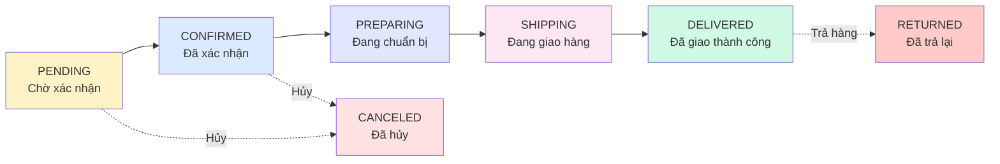

# 📦 Quy Trình Quản Lý Đơn Hàng Của Nhà Cung Cấp

## 📋 Tổng Quan

Tài liệu này mô tả chi tiết quy trình quản lý đơn hàng từ góc nhìn của **Nhà cung cấp (Supplier)**, bao gồm các trạng thái đơn hàng, luồng xử lý, và các API endpoints liên quan.

---

## 🔄 Sơ Đồ Trạng Thái Đơn Hàng



---

## 📊 Chi Tiết Các Trạng Thái Đơn Hàng

### 1. **PENDING** - Chờ Xác Nhận
- **Mô tả**: Đơn hàng vừa được tạo, đang chờ nhà cung cấp xác nhận
- **Màu hiển thị**: Vàng nhạt (#fef3c7)
- **Thời gian tồn tại**: Tối đa 24 giờ (có thể cấu hình)
- **Hành động cho phép**:
  - ✅ Nhà cung cấp: **Xác nhận** hoặc **Hủy đơn**
  - ✅ Khách hàng: **Hủy đơn** (miễn phí)
- **Notification**: 
  - 📨 Gửi cho nhà cung cấp: "Bạn có đơn hàng mới #[ORDER_CODE]"
  - 📨 Gửi cho khách hàng: "Đơn hàng #[ORDER_CODE] đã được tạo thành công"

### 2. **CONFIRMED** - Đã Xác Nhận
- **Mô tả**: Nhà cung cấp đã xác nhận đơn hàng, đang chờ chuẩn bị hàng
- **Màu hiển thị**: Xanh dương nhạt (#dbeafe)
- **Điều kiện chuyển**:
  - Thanh toán COD: Tự động chuyển sau khi xác nhận
  - Thanh toán online: Chỉ chuyển sau khi thanh toán thành công
- **Hành động cho phép**:
  - ✅ Nhà cung cấp: **Bắt đầu chuẩn bị** hoặc **Hủy đơn** (có lý do)
  - ⚠️ Khách hàng: **Yêu cầu hủy** (cần phê duyệt)
- **Notification**:
  - 📨 Gửi cho khách hàng: "Đơn hàng #[ORDER_CODE] đã được xác nhận bởi [STORE_NAME]"

### 3. **PREPARING** - Đang Chuẩn Bị
- **Mô tả**: Nhà cung cấp đang đóng gói và chuẩn bị hàng hóa
- **Màu hiển thị**: Tím nhạt (#e0e7ff)
- **Thời gian chuẩn bị**: Thường 1-3 ngày (tùy cấu hình cửa hàng)
- **Hành động cho phép**:
  - ✅ Nhà cung cấp: **Bắt đầu giao hàng** (cần tracking number)
  - ❌ Không thể hủy trực tiếp (phải qua quy trình đặc biệt)
- **Notification**:
  - 📨 Gửi cho khách hàng: "Đơn hàng #[ORDER_CODE] đang được chuẩn bị"

### 4. **SHIPPING** - Đang Giao Hàng
- **Mô tả**: Đơn hàng đang được vận chuyển đến khách hàng
- **Màu hiển thị**: Hồng nhạt (#fce7f3)
- **Yêu cầu**:
  - 📦 Tracking number (mã vận đơn)
  - 🚚 Shipping provider (đơn vị vận chuyển)
- **Hành động cho phép**:
  - ✅ Nhà cung cấp/Admin: **Xác nhận đã giao**
  - ⚠️ Khách hàng: **Yêu cầu hoàn trả** (nếu có vấn đề)
- **Notification**:
  - 📨 Gửi cho khách hàng: "Đơn hàng #[ORDER_CODE] đang được giao. Mã vận đơn: [TRACKING]"

### 5. **DELIVERED** - Đã Giao Thành Công
- **Mô tả**: Khách hàng đã nhận được hàng thành công
- **Màu hiển thị**: Xanh lá nhạt (#d1fae5)
- **Tự động thực hiện**:
  - 💰 Chuyển tiền vào ví nhà cung cấp (trừ hoa hồng)
  - ⭐ Cho phép khách hàng đánh giá sản phẩm
  - 🎁 Cộng điểm tích lũy cho khách hàng
- **Hành động cho phép**:
  - ✅ Khách hàng: **Đánh giá sản phẩm** (trong 30 ngày)
  - ⚠️ Khách hàng: **Yêu cầu trả hàng** (trong 7 ngày)
- **Notification**:
  - 📨 Gửi cho khách hàng: "Đơn hàng #[ORDER_CODE] đã được giao thành công"
  - 📨 Gửi cho nhà cung cấp: "Đơn hàng #[ORDER_CODE] hoàn thành. Số tiền đã được chuyển vào ví"

### 6. **CANCELED** - Đã Hủy
- **Mô tả**: Đơn hàng đã bị hủy bởi khách hàng hoặc nhà cung cấp
- **Màu hiển thị**: Đỏ nhạt (#fee2e2)
- **Lý do hủy**:
  - Khách hàng hủy (PENDING/CONFIRMED)
  - Nhà cung cấp hủy (hết hàng, không thể giao)
  - Hệ thống tự động hủy (quá thời gian xử lý)
- **Xử lý tự động**:
  - 📦 Hoàn trả tồn kho
  - 💸 Hoàn tiền nếu đã thanh toán
  - ⚠️ Ghi nhận vi phạm nếu lỗi từ khách hàng
- **Notification**:
  - 📨 Gửi thông báo kèm lý do hủy

### 7. **RETURNED** - Đã Trả Lại
- **Mô tả**: Khách hàng đã trả lại hàng sau khi nhận
- **Màu hiển thị**: Đỏ đậm (#fecaca)
- **Điều kiện**:
  - Phải trong thời gian cho phép trả hàng (7 ngày)
  - Có lý do hợp lệ (hàng lỗi, sai mô tả, etc.)
- **Xử lý**:
  - 📦 Kiểm tra hàng trả
  - 💸 Hoàn tiền nếu hợp lệ
  - 📊 Cập nhật thống kê chất lượng cửa hàng

---

## 🔐 Quy Trình Xử Lý Đơn Hàng Của Nhà Cung Cấp

### **Bước 1: Nhận Đơn Hàng Mới** (PENDING)

```
┌─────────────────────────────────────────────┐
│  Khách hàng đặt hàng                        │
│  → Hệ thống tạo đơn PENDING                 │
│  → Gửi notification cho Supplier            │
└─────────────────────────────────────────────┘
              ↓
┌─────────────────────────────────────────────┐
│  Nhà cung cấp nhận được thông báo:          │
│  • Email/SMS/In-app notification            │
│  • Dashboard hiển thị đơn hàng mới          │
│  • Âm thanh cảnh báo (nếu bật)              │
└─────────────────────────────────────────────┘
```

**API Endpoint**: `GET /api/orders/store/{storeId}?status=PENDING`

**Response**:
```json
{
  "status": "success",
  "data": {
    "content": [
      {
        "orderId": "550e8400-e29b-41d4-a716-446655440000",
        "orderCode": "ORD20250105001",
        "status": "PENDING",
        "totalAmount": 250000,
        "createdAt": "2025-01-05T10:30:00",
        "customer": {
          "fullName": "Nguyễn Văn A",
          "phoneNumber": "0901234567"
        },
        "shippingAddress": {
          "fullAddress": "123 Đường ABC, Quận 1, TP.HCM"
        }
      }
    ],
    "totalElements": 5,
    "totalPages": 1
  }
}
```

---

### **Bước 2: Xác Nhận Đơn Hàng** (PENDING → CONFIRMED)

```
┌─────────────────────────────────────────────┐
│  Nhà cung cấp kiểm tra:                     │
│  ✓ Tồn kho đủ hàng                          │
│  ✓ Địa chỉ giao hàng hợp lệ                 │
│  ✓ Thông tin khách hàng đầy đủ              │
└─────────────────────────────────────────────┘
              ↓
┌─────────────────────────────────────────────┐
│  Nhà cung cấp click "Xác nhận đơn"          │
│  → API call: POST /api/orders/{id}/confirm  │
│  → Status: PENDING → CONFIRMED              │
└─────────────────────────────────────────────┘
              ↓
┌─────────────────────────────────────────────┐
│  Hệ thống tự động:                          │
│  • Gửi notification cho khách hàng          │
│  • Cập nhật thời gian ước tính giao hàng    │
│  • Khóa tồn kho cho đơn hàng này            │
└─────────────────────────────────────────────┘
```

**API Endpoint**: `POST /api/orders/{orderId}/confirm`

**Request**: No body required

**Response**:
```json
{
  "status": "success",
  "message": "Đơn hàng đã được xác nhận",
  "data": {
    "orderId": "550e8400-e29b-41d4-a716-446655440000",
    "status": "CONFIRMED",
    "estimatedDeliveryDate": "2025-01-10"
  }
}
```

**⚠️ Trường hợp từ chối đơn hàng**:

```
API: POST /api/orders/{orderId}/cancel
Body: {
  "reason": "Hết hàng",
  "canceledBy": "SUPPLIER"
}
```

---

### **Bước 3: Chuẩn Bị Đơn Hàng** (CONFIRMED → PREPARING)

```
┌─────────────────────────────────────────────┐
│  Nhà cung cấp bắt đầu đóng gói:             │
│  1. Lấy sản phẩm từ kho                     │
│  2. Kiểm tra chất lượng sản phẩm            │
│  3. Đóng gói cẩn thận                       │
│  4. Gắn mã vận đơn (nếu có)                 │
└─────────────────────────────────────────────┘
              ↓
┌─────────────────────────────────────────────┐
│  Nhà cung cấp click "Bắt đầu chuẩn bị"      │
│  → API: POST /api/orders/{id}/prepare       │
│  → Status: CONFIRMED → PREPARING            │
└─────────────────────────────────────────────┘
              ↓
┌─────────────────────────────────────────────┐
│  Khách hàng nhận notification:              │
│  "Đơn hàng #ORD001 đang được chuẩn bị"      │
└─────────────────────────────────────────────┘
```

**API Endpoint**: `POST /api/orders/{orderId}/prepare`

**Request**: No body required

**Response**:
```json
{
  "status": "success",
  "message": "Đã bắt đầu chuẩn bị đơn hàng",
  "data": {
    "orderId": "550e8400-e29b-41d4-a716-446655440000",
    "status": "PREPARING",
    "preparedAt": "2025-01-05T14:30:00"
  }
}
```

---

### **Bước 4: Bắt Đầu Giao Hàng** (PREPARING → SHIPPING)

```
┌─────────────────────────────────────────────┐
│  Nhà cung cấp chuẩn bị giao hàng:           │
│  1. Chọn đơn vị vận chuyển                  │
│     - Giao hàng nhanh (GHN)                 │
│     - Giao hàng tiết kiệm (GHTK)            │
│     - Viettel Post                          │
│     - Tự giao hàng                          │
│  2. Nhập mã vận đơn (tracking number)       │
│  3. Cập nhật trạng thái                     │
└─────────────────────────────────────────────┘
              ↓
┌─────────────────────────────────────────────┐
│  Nhà cung cấp click "Bắt đầu giao hàng"     │
│  → API: POST /api/orders/{id}/ship          │
│  → Params:                                  │
│     • trackingNumber: "GHN123456789"        │
│     • shippingProvider: "GHN"               │
│  → Status: PREPARING → SHIPPING             │
└─────────────────────────────────────────────┘
              ↓
┌─────────────────────────────────────────────┐
│  Hệ thống tự động:                          │
│  • Tạo Shipment record                      │
│  • Gửi tracking info cho khách hàng         │
│  • Cập nhật ETA (thời gian giao dự kiến)    │
└─────────────────────────────────────────────┘
```

**API Endpoint**: `POST /api/orders/{orderId}/ship`

**Query Parameters**:
- `trackingNumber` (required): Mã vận đơn
- `shippingProvider` (required): Đơn vị vận chuyển

**Example**:
```
POST /api/orders/550e8400-e29b-41d4-a716-446655440000/ship?trackingNumber=GHN123456789&shippingProvider=GHN
```

**Response**:
```json
{
  "status": "success",
  "message": "Đơn hàng đang được giao",
  "data": {
    "orderId": "550e8400-e29b-41d4-a716-446655440000",
    "status": "SHIPPING",
    "shipment": {
      "trackingNumber": "GHN123456789",
      "shippingProvider": "GHN",
      "estimatedDeliveryDate": "2025-01-10"
    }
  }
}
```

---

### **Bước 5: Xác Nhận Đã Giao** (SHIPPING → DELIVERED)

```
┌─────────────────────────────────────────────┐
│  Shipper giao hàng thành công               │
│  → Khách hàng nhận hàng & xác nhận          │
└─────────────────────────────────────────────┘
              ↓
┌─────────────────────────────────────────────┐
│  Nhà cung cấp/Admin xác nhận:               │
│  → API: POST /api/orders/{id}/deliver       │
│  → Status: SHIPPING → DELIVERED             │
└─────────────────────────────────────────────┘
              ↓
┌─────────────────────────────────────────────┐
│  🎉 Hệ thống tự động xử lý:                 │
│                                             │
│  1. 💰 Tính toán & chuyển tiền:             │
│     • Tổng đơn hàng: 250,000 VNĐ            │
│     • Hoa hồng (5%): -12,500 VNĐ            │
│     • Phí giao hàng: -20,000 VNĐ            │
│     • Nhà cung cấp nhận: 217,500 VNĐ        │
│                                             │
│  2. 🏦 Cập nhật ví:                         │
│     • Supplier Wallet: +217,500 VNĐ         │
│     • Commission Wallet: +12,500 VNĐ        │
│     • Tạo Transaction record                │
│                                             │
│  3. ⭐ Cộng điểm tích lũy:                   │
│     • Customer Points: +250 điểm            │
│     • Check tier upgrade                    │
│                                             │
│  4. 📝 Cho phép đánh giá:                   │
│     • Enable review for all products        │
│     • Gửi email nhắc nhở đánh giá           │
│                                             │
│  5. 📊 Cập nhật thống kê:                   │
│     • Store revenue                         │
│     • Product sold count                    │
│     • Supplier performance                  │
└─────────────────────────────────────────────┘
```

**API Endpoint**: `POST /api/orders/{orderId}/deliver`

**Request**: No body required

**Response**:
```json
{
  "status": "success",
  "message": "Đơn hàng đã được giao thành công",
  "data": {
    "orderId": "550e8400-e29b-41d4-a716-446655440000",
    "status": "DELIVERED",
    "deliveredAt": "2025-01-08T16:45:00",
    "payment": {
      "supplierReceived": 217500,
      "commission": 12500,
      "shippingFee": 20000
    },
    "rewards": {
      "pointsAwarded": 250,
      "newTotalPoints": 1500
    }
  }
}
```

---

## 🚫 Quy Trình Hủy Đơn Hàng

### **Hủy Trực Tiếp** (PENDING/CONFIRMED)

```
┌─────────────────────────────────────────────┐
│  Điều kiện:                                 │
│  • Status = PENDING hoặc CONFIRMED          │
│  • Có lý do hủy hợp lệ                      │
└─────────────────────────────────────────────┘
              ↓
┌─────────────────────────────────────────────┐
│  API: POST /api/orders/{id}/cancel          │
│  Body: {                                    │
│    "reason": "Hết hàng",                    │
│    "canceledBy": "SUPPLIER"                 │
│  }                                          │
└─────────────────────────────────────────────┘
              ↓
┌─────────────────────────────────────────────┐
│  Hệ thống xử lý:                            │
│  1. 📦 Hoàn trả inventory                   │
│  2. 💸 Hoàn tiền (nếu đã thanh toán)        │
│  3. 📨 Gửi notification cho khách hàng      │
│  4. ⚠️ Ghi nhận vi phạm (nếu cần)          │
└─────────────────────────────────────────────┘
```

### **Yêu Cầu Hủy** (PREPARING/SHIPPING)

```
┌─────────────────────────────────────────────┐
│  ⚠️ Đơn hàng đã PREPARING/SHIPPING          │
│  → Không thể hủy trực tiếp                  │
│  → Phải tạo OrderCancelRequest              │
└─────────────────────────────────────────────┘
              ↓
┌─────────────────────────────────────────────┐
│  Quy trình:                                 │
│  1. Tạo yêu cầu hủy                         │
│  2. Admin xem xét                           │
│  3. Phê duyệt/Từ chối                       │
│  4. Xử lý hoàn tiền nếu được duyệt          │
└─────────────────────────────────────────────┘
```

---

## 📱 Giao Diện Quản Lý Đơn Hàng

### **Dashboard Overview**

```
╔══════════════════════════════════════════════════════╗
║  📊 THỐNG KÊ ĐỚN HÀNG HÔM NAY                        ║
╠══════════════════════════════════════════════════════╣
║  🔔 Chờ xác nhận:        5 đơn                       ║
║  📦 Đang chuẩn bị:       3 đơn                       ║
║  🚚 Đang giao hàng:     12 đơn                       ║
║  ✅ Đã giao thành công:  8 đơn                       ║
║  ❌ Đã hủy:              2 đơn                       ║
╠══════════════════════════════════════════════════════╣
║  💰 Doanh thu hôm nay:   15,250,000 VNĐ              ║
║  💼 Hoa hồng:              -762,500 VNĐ              ║
║  📈 Doanh thu ròng:      14,487,500 VNĐ              ║
╚══════════════════════════════════════════════════════╝
```

### **Danh Sách Đơn Hàng**

```
╔═══════════════════════════════════════════════════════════════╗
║  MÃ ĐƠN      │ KHÁCH HÀNG    │ TRẠNG THÁI  │ TỔNG TIỀN       ║
╠═══════════════════════════════════════════════════════════════╣
║  ORD001 🔔   │ Nguyễn Văn A  │ PENDING     │ 250,000 VNĐ     ║
║              │ 0901234567    │             │ [Xác nhận]      ║
╠───────────────────────────────────────────────────────────────╣
║  ORD002 📦   │ Trần Thị B    │ PREPARING   │ 350,000 VNĐ     ║
║              │ 0907654321    │             │ [Bắt đầu giao]  ║
╠───────────────────────────────────────────────────────────────╣
║  ORD003 🚚   │ Lê Văn C      │ SHIPPING    │ 180,000 VNĐ     ║
║              │ 0903456789    │ GHN12345    │ [Đã giao]       ║
╚═══════════════════════════════════════════════════════════════╝
```

### **Chi Tiết Đơn Hàng**

```
╔══════════════════════════════════════════════════════╗
║  📋 THÔNG TIN ĐỚN HÀNG #ORD20250105001              ║
╠══════════════════════════════════════════════════════╣
║  Trạng thái:    🔔 Chờ xác nhận (PENDING)           ║
║  Ngày đặt:      05/01/2025 10:30                    ║
║  Thanh toán:    💵 COD (Thanh toán khi nhận hàng)   ║
╠══════════════════════════════════════════════════════╣
║  👤 KHÁCH HÀNG                                       ║
║  Họ tên:        Nguyễn Văn A                        ║
║  SĐT:           0901234567                          ║
║  Email:         nguyenvana@email.com                ║
╠══════════════════════════════════════════════════════╣
║  📍 ĐỊA CHỈ GIAO HÀNG                                ║
║  123 Đường ABC, Phường Bến Nghé                     ║
║  Quận 1, Thành phố Hồ Chí Minh                      ║
║  Ghi chú: Gọi trước 15 phút                         ║
╠══════════════════════════════════════════════════════╣
║  🛍️ SẢN PHẨM                                         ║
║  1. Combo rau củ tươi 1kg                           ║
║     Số lượng: 2 × 75,000 = 150,000 VNĐ             ║
║  2. Trái cây nhập khẩu                              ║
║     Số lượng: 1 × 80,000 = 80,000 VNĐ              ║
╠══════════════════════════════════════════════════════╣
║  💰 TỔNG KẾT                                         ║
║  Tạm tính:              230,000 VNĐ                 ║
║  Giảm giá (10%):        -23,000 VNĐ                 ║
║  Phí vận chuyển:        +20,000 VNĐ                 ║
║  ━━━━━━━━━━━━━━━━━━━━━━━━━━━━━━                    ║
║  TỔNG CỘNG:             227,000 VNĐ                 ║
╠══════════════════════════════════════════════════════╣
║  [✅ Xác nhận đơn hàng]  [❌ Từ chối đơn]           ║
╚══════════════════════════════════════════════════════╝
```

---

## 🔔 Hệ Thống Thông Báo

### **Notification cho Nhà Cung Cấp**

| Sự kiện | Nội dung thông báo | Channel |
|---------|-------------------|---------|
| Đơn hàng mới | "🔔 Bạn có đơn hàng mới #[CODE]. Vui lòng xác nhận trong 24h" | In-app + Email |
| Khách hủy đơn | "❌ Đơn hàng #[CODE] đã bị khách hàng hủy" | In-app |
| Yêu cầu trả hàng | "⚠️ Khách hàng yêu cầu trả hàng #[CODE]. Lý do: [REASON]" | In-app + Email |
| Đơn hoàn thành | "✅ Đơn hàng #[CODE] hoàn thành. Đã chuyển [AMOUNT] VNĐ vào ví" | In-app |
| Review mới | "⭐ Khách hàng đã đánh giá đơn hàng #[CODE]: [RATING] sao" | In-app |

### **Notification cho Khách Hàng**

| Sự kiện | Nội dung thông báo |
|---------|-------------------|
| Đơn được xác nhận | "✅ Đơn hàng #[CODE] đã được [STORE] xác nhận" |
| Đang chuẩn bị | "📦 Đơn hàng #[CODE] đang được chuẩn bị" |
| Đang giao hàng | "🚚 Đơn hàng #[CODE] đang được giao. Mã vận đơn: [TRACKING]" |
| Đã giao thành công | "🎉 Đơn hàng #[CODE] đã được giao thành công. Đánh giá ngay!" |
| Đơn bị hủy | "❌ Đơn hàng #[CODE] đã bị hủy. Lý do: [REASON]" |

---

## 💰 Quy Trình Thanh Toán & Chia Tiền

### **Khi Đơn Hàng DELIVERED**

```
                TỔNG ĐƠN HÀNG: 250,000 VNĐ
                        ↓
        ┌───────────────────────────────────┐
        │  1. Tính hoa hồng (5%)            │
        │     250,000 × 5% = 12,500 VNĐ     │
        └───────────────────────────────────┘
                        ↓
        ┌───────────────────────────────────┐
        │  2. Trừ phí giao hàng             │
        │     Shipping fee: 20,000 VNĐ      │
        └───────────────────────────────────┘
                        ↓
        ┌───────────────────────────────────┐
        │  3. Tính số tiền nhà cung cấp nhận│
        │     250,000 - 12,500 - 20,000     │
        │     = 217,500 VNĐ                 │
        └───────────────────────────────────┘
                        ↓
        ┌───────────────────────────────────┐
        │  4. Chuyển tiền vào ví            │
        │     Supplier Wallet: +217,500     │
        │     Commission Wallet: +12,500    │
        └───────────────────────────────────┘
                        ↓
        ┌───────────────────────────────────┐
        │  5. Tạo Transaction record        │
        │     Type: ORDER_PAYMENT           │
        │     Status: COMPLETED             │
        └───────────────────────────────────┘
```

---

## 🛡️ Xử Lý Ngoại Lệ & Lỗi

### **Timeout Xác Nhận**

```
IF (order.status == PENDING && 
    now() - order.createdAt > 24 hours) {
    
    AUTO CANCEL ORDER
    REASON: "Quá thời gian xác nhận"
    REFUND: Nếu đã thanh toán
    RESTORE: Tồn kho
    PENALTY: Giảm điểm uy tín nhà cung cấp
}
```

### **Khách Hàng Từ Chối Nhận Hàng**

```
IF (status == SHIPPING && 
    customer refuses to receive) {
    
    CREATE RETURN REQUEST
    STATUS: RETURNED
    REFUND: 100% - phí vận chuyển
    PENALTY: Ghi nhận vi phạm khách hàng
}
```

### **Sản Phẩm Lỗi**

```
IF (status == DELIVERED && 
    product has defect) {
    
    ALLOW RETURN within 7 days
    PROCESS:
      1. Customer uploads evidence
      2. Supplier reviews
      3. Admin arbitrates (if needed)
      4. Refund if valid
    PENALTY: Affect supplier reputation
}
```

---

## 📊 Báo Cáo & Thống Kê

### **Dashboard Metrics**

```typescript
interface SupplierOrderMetrics {
  today: {
    totalOrders: number;
    pendingOrders: number;
    preparingOrders: number;
    shippingOrders: number;
    deliveredOrders: number;
    canceledOrders: number;
    revenue: number;
    commission: number;
    netRevenue: number;
  };
  thisMonth: {
    totalOrders: number;
    completionRate: number;  // DELIVERED / (DELIVERED + CANCELED)
    avgOrderValue: number;
    revenue: number;
  };
  performance: {
    averageConfirmTime: string;      // "2 giờ 30 phút"
    averagePreparationTime: string;  // "1 ngày 3 giờ"
    customerSatisfaction: number;    // 4.5/5.0
    returnRate: number;              // 2.3%
  };
}
```

---

## 🔧 Cấu Hình Hệ Thống

### **Thời Gian Xử Lý**

| Giai đoạn | Thời gian mặc định | Có thể cấu hình |
|-----------|-------------------|-----------------|
| Xác nhận đơn | 24 giờ | ✅ |
| Chuẩn bị hàng | 1-3 ngày | ✅ |
| Giao hàng | 3-7 ngày | ❌ (phụ thuộc shipper) |
| Cho phép trả hàng | 7 ngày | ✅ |
| Cho phép đánh giá | 30 ngày | ✅ |

### **Hoa Hồng & Phí**

```typescript
interface CommissionConfig {
  defaultRate: 5.0;        // %
  minimumOrder: 50000;     // VNĐ
  shippingFee: {
    standard: 20000,       // VNĐ
    express: 35000,        // VNĐ
    sameDay: 50000        // VNĐ
  };
}
```

---

## 🚀 Best Practices

### **Cho Nhà Cung Cấp**

1. ✅ **Xác nhận đơn hàng nhanh chóng** (trong vòng 2-4 giờ)
2. ✅ **Cập nhật trạng thái chính xác và kịp thời**
3. ✅ **Đóng gói cẩn thận**, đảm bảo chất lượng
4. ✅ **Ghi rõ tracking number** khi giao hàng
5. ✅ **Phản hồi khách hàng** nhanh chóng nếu có vấn đề
6. ❌ **Tránh hủy đơn** khi đã xác nhận
7. ❌ **Không để quá thời gian xử lý**

### **Tối Ưu Hiệu Suất**

- 🔔 **Bật thông báo đẩy** để không bỏ lỡ đơn hàng mới
- 📱 **Sử dụng app mobile** để xử lý đơn hàng mọi lúc mọi nơi
- 📊 **Theo dõi thống kê** để cải thiện hiệu suất
- ⚡ **Chuẩn bị trước** các sản phẩm bán chạy
- 🤝 **Hợp tác với shipper uy tín** để đảm bảo thời gian giao hàng

---

## 📞 Hỗ Trợ & Liên Hệ

**Trường hợp cần hỗ trợ:**
- 📧 Email: supplier-support@savefood.vn
- 📱 Hotline: 1900-xxxx (24/7)
- 💬 Chat: Trong app quản lý
- 📚 Tài liệu: docs.savefood.vn

---

**Phiên bản tài liệu**: 1.0  
**Ngày cập nhật**: 05/01/2025  
**Tác giả**: SaveFood Development Team

---

